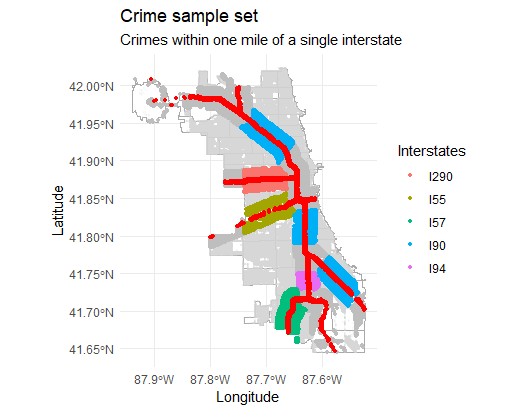
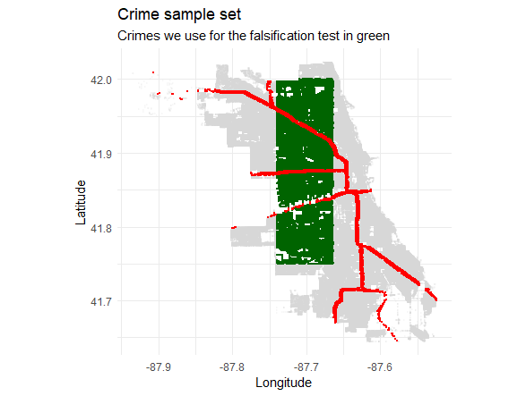

# Air Pollution and Criminal Activity in Chicago  

Author: Jana Russ

#< ignore
```{r "setup"}
run=function(){
library(RTutor)
library(yaml)
library(knitr)

setwd("~/AirPollutionCriminalActivity") #adapt path
ps.name = "AirPollutionCriminalActivity"
sol.file = paste0(ps.name, "_sol.Rmd")
libs = c("dplyr", "scales", "kableExtra", "ggplot2", "sf", "openair", "sandwich", "lmtest", "ggdag", "modelsummary", "lfe", "tidyr")

# Generate problem set files in working directory
create.ps(sol.file = sol.file, ps.name = ps.name, user.name = NULL,libs = libs, stop.when.finished = FALSE, addons="quiz", var.txt.file = "variables.txt")

# Show in webbrowser. You can adapt the argumets below
show.shiny.ps(ps.name, load.sav = FALSE, launch.browser = TRUE, sample.solution =FALSE, is.solved = FALSE) #sample.solution=TRUE all chunks are already filled with the sample solution.
  
# This function creates a skeleton for your problem set package
  rtutor.package.skel(sol.file=sol.file, ps.name=ps.name,libs=libs,
    pkg.name="RTutorAirPollCrime",   
    pkg.parent.dir = "~/AirPollutionCriminalActivity", # Parent directory 
    author="Jana Russ", # Your name
    github.user="JanaRuss",     # Your github user name
    extra.code.file=NULL, # name of extra.code.file
    var.txt.file="variables.txt",    # name of var.txt.file
    overwrite=FALSE  # Do you want to override if package directory exists?
  )


}
run()
```
#>

## Welcome!

Welcome to this interactive problem set which is part of my bachelor's thesis at Ulm University.
It is based on the paper titled Air Pollution and Criminal Activity: Microgeographic Evidence from Chicago which was published in the Journal of *American Economic Journal: Applied Economics* in 2021 and analyses the connection between Air Pollution un Criminal Activity in Chicago.
In the course of the study, I will occasionally refer to it as *paper*.
The paper, a supplemental appendix and data are available online by clicking on the links below.

-   **paper**: <https://www.aeaweb.org/articles?id=10.1257/app.20190091>
-   **appendix**: <http://www.aeaweb.org/content/file?id=15296>
-   **data**: <https://www.openicpsr.org/openicpsr/project/119403/version/V1/view>

In this problem set, we will explore an intriguing question: Does air pollution affect criminal activity? Initially, the question may seem surprising, but a growing number of studies suggest a possible connection between these two phenomena.

Numerous studies have contributed to the increasing body of evidence that supports a link between air pollution and criminal behavior. For example, a study carried out by Cesur, Tekin and Ulker (2013) discovered that higher levels of air pollution are associated with increased rates of violent crimes, such as assault and robbery, in the United States. Similarly, another study conducted by He et al. (2019) examined the correlation between air pollution and crime rates in Chinese cities, revealing a positive link between pollution levels and property crimes.

In particular, we will focus on the case of Chicago, a large and diverse city that faces both high levels of air pollution and crime. Air pollution is a serious environmental problem that harms human health and well-being. Exposure to air pollutants can cause or worsen various diseases, as well as increase the risk of premature death. 
In addition to these health impacts, air pollution may also have societal consequences, such as influencing criminal behavior. 
This problem set replicates some of the main findings from Herrnstadt, Heyes, and Muehlegger (2021) to examine the impact of air pollution on criminal activity. It utilizes microgeographic evidence from Chicago to investigate how air pollution affects individuals' propensity to commit crimes and how crime patterns change across space and time in response to variations in air quality. According to the paper, air pollution increases violent crime by 1.9 % on the downwind side of highways compared to the upwind side.

## Exercise Content

1.  Overview of data

    1.1 Crimes in Chicago
   
    1.2 Mapping crime locations

    1.3 Air pollution in Chicago

2.  City level regression analysis 
    
    2.1 Naive city level regression analysis

    2.2 Controlling for influential factors 
    
    2.3 City level regression models 

3.  Regression models for microgeographic evidence 

    3.1 Regression: Crime downwind of interstates
    
    3.2 Placebo interstate test

4.  Conclusion
 
5.  References

## How to solve this problem set

Each exercise can be solved on its own.
Nevertheless, it is advisable to complete the tasks in the listed order, as this will guide you step by step through the analysis.
Descriptive statistics will be used as a starting point, followed by econometric analysis (falsification tests and regressions).
There are quizzes, info boxes and code chunks in this problem set.
You are going to replace missing R code in code chunks to complete tasks.
You must click `check` after altering the chunk in order to find out whether your answer is accurate.
First hit `edit` to begin each new exercise.
If you're having trouble completing a task, you may use the `hint` button to get some extra help.
It is possible to view the correct code using the `solution` button.
If you want to execute the code without checking it, just press `run` and verify by clicking on `check` afterwards.
If you want to take a look at the example data click on `data`. This will open the `Data Explorer` section. You can find more details about each column by clicking on `Description` in the `Data Explorer`. 

Have fun completing the tasks and earning the awards!

The problem set is published here:

-   `GitHub`: [https://](https://github.com/)

**Note:** Please open all links in a new tab by a right mouse click and select *Open link in new tab*.
This will prevent your progress from being lost as you work through the problem set.

## Overview

Let us begin by providing an overview of the paper by discussing the structure of Chicago's criminal activities and introducing the issue of air pollution as a potential factor influencing criminal activity.
This following problem set will entail a descriptive analysis of crime rates as well as numerous wind, weather and air pollution indicators across different Chicago neighborhoods. We might discover valuable information about the predominant patterns and qualities of the data by examining these statistics.
Next, we are going to examine a sequential approach of constructing regression analyses, incorporating essential elements such as fixed effects and control variables. We find that an increase in particulate matter has an impact on violent crimes and factors such as wind and certain days of the week play an important role in our considerations. 
Followed by a novel identification strategy based on the wind direction, we exploit the fact that wind blows pollution from major interstates to nearby areas, creating exogenous variation in pollution exposure. We compare crime rates on opposite sides of the interstates on days when the wind is orthogonal to the road.
Finally, we will reach the end of the problem set by summarizing the key findings.
Through this study, we hope to interactively provide valuable insights into criminal behavior and draw attention to the problem of air quality in urban areas of Chicago.

## Exercise 1 -- Overview of data

We are interested in three primary data sets to examine the relationship between **air pollution and criminal activity in Chicago**.
These data sets include **crime data, air pollution data and weather data**, each of which offers valuable and different insights.
By combining these data sets, we aim to gain a comprehensive understanding of the relationships between air pollution, criminal activity and weather conditions in Chicago.
Including data from 2001-2012 allows us to capture long-term trends and variability, while the spatially detailed information provides a city level analysis of different neighborhoods.

This exercise 1 is divided into three parts.
The first and second part focuses on **crime data**, then we include **air pollution data**.

### Structure for exercise 1

   1.1 Crimes in Chicago
   
   1.2 Mapping crime locations

   1.3 Air pollution in Chicago

## Exercise 1.1 -- Crime data in Chicago

The crime data used in our analysis comes from the [City of Chicago's open data portal](https://data.cityofchicago.org/Public-Safety/Crimes-2001-to-Present/ijzp-q8t2), specifically from the Citizen Law Enforcement Analysis and Reporting system maintained by the Chicago Police Department (CPD) and includes reported incidents of criminal activity in the city.
We use the collected crime data over several years, from 2001 to 2012, which allows for a comprehensive assessment of long-term patterns and trends.

First, we look at reported crimes in Chicago, focusing on particularly serious crimes, including murder, rape, robbery, assault, burglary, theft, arson and car theft that are recorded as Part 1 Crimes. They are classified as FBI code 1 to 8 and can be categorized in violent or property crimes. 
To begin, we need to import the dataset and store it into a variable.
Our dataset, named `part1_crimes.rds`, contains several variables such as the FBI Code, the type of crime, the date, the latitude and longitude of the address where the crime was reported, the crime category , and other details of the incident (e.g., whether an arrest was made, whether the crime was classified as domestic) for the years 2001-2012.

#< info "FBI Codes:"
FBI codes are standardized codes used by the FBI to classify and categorize different types of crimes.
These codes provide a uniform framework for reporting and analyzing crime statistics.

Part 1 crimes, as defined by the FBI, include serious crimes such as murder, rape, robbery, aggravated assault, burglary, theft, motor vehicle theft and arson. The FBI codes for Part1 crimes in our dataset range from 1 to 8.
These crimes are considered the most significant and receive increased attention due to their seriousness and impact on public safety.
Part 1 crimes serve as a benchmark for evaluating overall crime rates and trends. 

Part 2 crimes, on the other hand, include less serious crimes.
These crimes cover a wide range of offenses, including simple assault, fraud, drug offenses, vandalism, prostitution, gambling and various other nonviolent and less serious offenses.
These offenses remain important to understand the overall criminal landscape but tend to have lower priority in terms of law enforcement efforts and public attention.

(<https://ucr.fbi.gov/crime-in-the-u.s/2010/crime-in-the-u.s.-2010/offense-definitions>).
#>

To load our dataset, we can use the `readRDS()` function.
To easily access the dataset later, we can store our data frame in a variable called `crimes`.

#< info "How to load and save data with readRDS():"
a) Loading the dataset with `readRDS()`
```{r eval=FALSE}
readRDS("./path/of/data.rds")
```

b) Storing in a variable `data`.
```{r eval=FALSE}
data <- readRDS("./path/of/data.rds")
```
#>

**Task:** Load the dataset `part1_crimes.rds` and store it in the variable `crimes`.
To do so, use the command `readRDS()`. The code is already provided, just click on `check`. 
```{r}
#< task
# Read in the data using readRDS() and store in `crimes`
crimes <- readRDS("./material/part1_crimes.rds")
#>
#< hint
display("Call the function readRDS() with the file path of the .rds data file and store it into `crimes`. Remember to put the path into quotation marks.")
#>
```

After loading and storing the data, we can have a closer look at the data stored in `crimes`.

### Overview of Crime Data

In R there are numerous ways to approach data.
We will use the `head()` and `sample_n()` commands to make ourselves familiar with the variables contained in our `crimes` data frame.
These commands will show us the first part or random selection of rows of our data frame.

**Task:** We want to inspect the first three rows of `crimes` of our data set. Your task is to call the function `head()` with two arguments that are separated by a comma: the name of the data frame and the number of rows you want to display. 
After pressing `check` you will get feedback whether your solution is correct.
If you do not know how to start, press `hint`.
```{r optional=TRUE}
#< task
# Show the first three rows of crimes using the name of the data frame within the head() function.  
#>
head(crimes,3)
#< hint
display("Call the function head() with the name of the data frame.")
#>
```

**Task:** We want to inspect a random sample of six rows. Call the function `sample_n()` with two arguments that are separated by a comma: the name of the data frame and the number of rows you want to display.
```{r optional=TRUE}
#< task
# Display six randomly chosen rows of crimes using sample_n().
#>
sample_n(crimes,6)
#< hint
display("Call the function sample_n() with two arguments that are separated by a comma: the name of the data frame and the number of rows you want to display.")
#>
```

#< award "Data Detective"
Congratulations! You have successfully demonstrated your data detective skills by effectively solving your first task of getting an overview of the `crimes` dataset. 
#>

#< quiz "crime types"
question: Take a guess. Which type of crime predominates in Chicago - violent crime or property crime?
sc:

-   property crimes.*

-   violent crimes.

success: Your answer is correct! Property crimes predominate in Chicago.
failure: Try again.
#>

Our focus now shifts to determining the **number of crimes per FBI code and crime category**.
To achieve this, we will calculate the total count, sum and proportion of crimes.
The *paper* mentions, that the nature and motivation of **violent and property** crimes differ, so we will estimate the relationship between crimes and interstates separately for each class of crimes.

We have, depending on the FBI code, the binary crime categories `violent` and `property` stored in the variable `category`.
Category `violent` contains homicide, forcible rape, assault and battery, while `property` crimes contain robbery, burglary, larceny, grand theft auto and arson.

In this following task we will learn how to reference a column in the `crimes` dataframe and calculate the sum of crimes for the category `violent`.

**Task:** Calculate the sum of violent crimes in the `crimes` dataframe using the `sum()` command and the `==` relational operator. 
To access a column in a dataframe, use the $ operator.
The $ operator allows direct access to a specific column of a dataframe.
We reference the `category` column using `crimes$category`. 
After pressing `check` you will get feedback whether your solution is correct.
If you do not know how to start, press `hint`.
```{r}
#< task
# Enter your code here.
#>
sum(crimes$category == "violent")
#< hint
display("Use the 'sum()' function and the referencing of columns in a dataframe to calculate the sum.")
#>
#< add_to_hint
display("Referencing columns in a dataframe is done by using the format 'dataframe$columnname'.")
#>
#< add_to_hint
display("The condition for the category 'violent' is crimes$category == 'violent'.")
#>
```

Among the total of over two million crimes committed in the period 2001-2012, almost 240,000 were violent crimes.

In R every package can be loaded using `library()`. To calculate the percentage of violent or property crimes per FBI code, we can use the `dplyr` package, which we load with `library(dplyr)`. 

#< info "The dplyr package and data aggregation" 
The `dplyr` package is a powerful library in R for data manipulation and data aggregation. With dplyr, data frames can be easily filtered, grouped, summarized and transformed.

Some important functions in dplyr are:

- `filter()`: Filters rows based on certain conditions.

- `group_by()`: Groups the data based on one or more variables.

- `summarise()`: Creates summaries of the data, e.g. by calculating averages, sums or counts. The result is a reduced data frame.

- `mutate()`: Adds, modifies or deletes columns.

- `arrange()`: Sorts the data according to certain criteria.

- `ungroup()`: Ungroups the data.

Further information and examples are available via the following link: 
<a href="https://CRAN.R-project.org/package=dplyr" target = "_blank"> CRAN.R-project.org/package=dplyr</a>.
#>

**Task:** After loading the `dplyr` package, group the dataset `crimes` by the columns `fbicode`, `primarytype` and `category`. Use the `group_by()` and `summarise()` functions from the `dplyr` package to calculate the number of occurrences (`frequency`) for each combination of `fbicode`, `primarytype` and `category`. Fill in the gaps represented by "___" and do not forget to `check` your solution. 
```{r}
#< fill_in
library(dplyr)
# Fill in the ___ 
#table_crimes <- crimes %>%
    #group_by(___, primarytype, category) %>%
    #summarise(frequency = n(), .groups = 'drop')
#>
table_crimes <- crimes %>%
    group_by(fbicode, primarytype, category) %>%
    summarise(frequency = n(), .groups = 'drop')
#< hint
display("Group by the 'fbicode' column too.")
#>
```

**Task:** Add a new column called `percent` that contains the percentage of occurrences for each combination of `fbicode`and `primarytype` per `category`. Use the `mutate()` function to add a column and calculate `frequency / sum(frequency)`. The `percent()` function from the `scales` package is used to get percentages.
```{r}
#< fill_in
library(scales)
#table_crimes <- table_crimes %>% 
     #group_by(___) %>%
     #mutate(percent = percent(frequency / sum(frequency)))%>%
     #ungroup()
#>
library(scales)
table_crimes <- table_crimes %>% 
      group_by(category) %>%
      mutate(percent = percent(frequency / sum(frequency)))%>%
      ungroup()
#< hint
display("Group by the 'category' column.")
#>
```

**Task:** Sort the column `category` in descending order. Use the `arrange()` function from the `dplyr` package and the `desc(category)` parameter. Just click `check` to see the created crimes table using `kable()`.
```{r}
#< task
table_crimes <- table_crimes %>% 
  arrange(desc(category)) 

library(kableExtra)
# show table
kable(table_crimes, align = c('c', 'l', 'c', 'c', 'c'), 
      format = 'html', 
      caption = "Crimes Table ",
      col.names = c("FBI Code","Primary Type","Category", "Frequency", "Percent")) %>%
  kable_paper(bootstrap_options = "striped", full_width = F, position = "left")%>%
  kable_styling(bootstrap_options = c("striped", "hover"), full_width = FALSE) %>%
  scroll_box(width = "100%", height = "600px")
#>
```

#< info "the `kableExtra` package:"
The `kableExtra` package provides additional formatting options, customization features and extensions to create **stylish and informative tables** in RMarkdown documents, HTML, PDF and other output formats.

You can find more information about `kableExtra` in the official documentation:
<a href="https://CRAN.R-project.org/package=kableExtra" target = "_blank"> CRAN.R-project.org/package=kableExtra</a>.
#>

Among the *violent crimes*, the majority consists of **battery (57 percent) and assault (32 percent)**.
On the other hand, out of the nearly 1.8 million instances of *property crimes*, the predominant categories are **larceny (~58 percent), burglary (~17 percent) and motor vehicle theft (~14 percent)**.
Therefore, we have a extensive data coverage over an extended time frame to enhances the reliability of our findings. 

#< info "Difference between battery and assault"
It may be unclear what the difference is between battery and assault.
In an **assault charge**, there is actual physical contact and harm, whereas in a **battery charge**, there is a threat of harm without actual physical harm to anyone.
This distinction helps distinguish between the two categories of offenses.

(https://vindicatelaw.com/assault-vs-battery-are-they-the-same-or-different-crimes/)
#>

#< award "Grouping Guru"
Congratulations! You have reached the status of "Grouping Guru" and got to know the `dplyr` and `kableExtra` package.
#>

### Exploring crime trends

Now, let us dive deeper into the dataset and explore annual crime trends. To provide a comprehensive view, we will calculate the normalized crime rates for different crime categories (`violent` and `property`), using the year 2001 as the baseline with a value of 100. This normalization allows us to compare the relative changes in crime rates across years and categories and create a line and point plot to visualize the trends over time. By examining the resulting plot, we can gain insights into how crime rates have evolved over the years, relative to the baseline year 2001. 

### Annual crime patterns

**Task:** We start by calculating `crimecount` as the sum of crimes per year and category using the `group_by()` and `mutate()` functions from dplyr. To establish the baseline for normalization, we find the maximum of `crimecount` (crime2001) for each crime category. We then remove the grouping using `ungroup()`. Just click `check`.

```{r}
#< task
# Calculate crimecount as the sum of crimes per year and category and crime2001 as the maximum crimecount for each category
annual_crimes <- crimes %>%
  group_by(year, category) %>%
  mutate(crimecount = n()) %>% 
  group_by(category) %>%
  mutate(crime2001 = max(crimecount)) %>%
  ungroup() 
#>
```

**Task:** The next step is to calculate the normalized crime rate (`normcrime`).
We divide `crimecount` by the corresponding `crime2001`, multiply by 100 and assign the result to `normcrime`. We also round `normcrime` to one decimal place.
Finally, we select the necessary columns (`year, normcrime and category`) and remove any duplicate rows using `distinct()`.
```{r}
#< fill_in
# Calculate normcrime as the crimecount divided by crime2001, multiplied by 100
#annual_crimes <- annual_crimes %>% 
  #arrange(year, category) %>% 
  #mutate(normcrime = round(100 * crimecount/___,1)) %>%
  #select(year, normcrime, category) %>% 
  #distinct()
#>
annual_crimes <- annual_crimes %>% 
  arrange(year, category) %>% 
  mutate(normcrime = round(100 * crimecount/crime2001,1)) %>%
  select(year, normcrime, category) %>% 
  distinct()
#< hint
display("Divide `crimecount` by `crime2001` and multiply by 100")
#>
```

**Task:** After preparing our `annual_crimes` dataset, we will use `ggplot()` from the package `ggplot2` to create a line and point plot to visualize the normalized average annual crimes over the years. 
The x-axis represents the years, the y-axis represents the normalized crime rates. The color and linetype are used to distinguish different crime categories. Just press `check`.

#< info "the `ggplot2` package:"
`ggplot2` is a popular data visualization package in R that provides a flexible and powerful framework for creating professional **graphics**. It is part of the tidyverse environment and is known for its approach to graphing grammar, which allows users to create visualizations by combining different layers and aesthetics.

You can find more information about `ggplot2` in the official documentation:
<a href="https://ggplot2.tidyverse.org/" target = "_blank"> ggplot2.tidyverse.org/</a>.
#>
```{r}
#< task
library(ggplot2)
ggplot(data = annual_crimes) +
  geom_point(mapping = aes(x = year, 
                           y = normcrime, 
                           color = category), 
             size = 2, 
             shape = 16) +
  geom_line(mapping = aes(x = year, 
                          y = normcrime, 
                          linetype = category)) +
  scale_x_continuous(labels = function(x) as.integer(x)) +
  labs(x = "Year",  
       y = "Annual crime count", 
       color = "Crime type", 
       linetype = "Crime type",
       title = "Crime trends I", 
       subtitle = "Normalized average annual crimes (2001 levels = 100)") + 
  theme_minimal()
#>
```

The graph presented visualizes the annual trends in property and violent crimes from 2001 to 2012. The crime rates are normalized, with the year 2001 set to 100. The graph shows that violent crimes have experienced a more significant decline compared to property crimes during this period. A small outlier in the crime rates can be observed in 2008 for the property crimes. 
Both types of crime are well below their 2001 levels, indicating an overall decrease in crime rates over the years, whereas violent crime has declined more rapidly than property crime. 

#< info "reasons for overall crime decline in Chicago"
The *paper* does not offer a definitive explanation for this trend. However, there are some possible factors that may have contributed to the decline in crime in Chicago. Some of these are:

- Improvements in policing and law enforcement, including the introduction of new technologies, policies, and programmes to prevent and combat crime, such as CPD's Project Safe Neighbourhoods Task Force (O’Shea, 2019). 

(https://imprimis.hillsdale.edu/spiraling-violence-chicago-causes-solutions/)

- The changing demographic and socioeconomic conditions in Chicago, including declines in poverty, unemployment, and inequality as well as increases in educational and income levels (Main, 2020). 

(https://chicago.suntimes.com/2022/7/15/23216341/violent-crime-soared-arrests-historic-lows-chicago-police-department-david-brown-lori-lightfoot)

- The presence of social media and other communication tools that allow people to better inform, network and organise themselves. 
#>

The following graph shows the monthly crime count per year for `violent` crimes. Perhaps we can see striking patterns that repeat themselves throughout the year? `check` the following chunk to get the graph. 
```{r}
#< task_notest
monthyear <- crimes %>% 
  filter(category == "violent") %>% 
  arrange(date) %>% 
  mutate(month = lubridate::month(date, label = FALSE)) %>%
  group_by(year, month) %>%
  summarize(
    date = first(date),
    crimes_per_month = n(), .groups = 'drop') %>% 
  ungroup()

ggplot(monthyear, aes(x = month, y = crimes_per_month, color = factor(year))) + 
  geom_point()+
  geom_line() +
  labs(x = "Month", y = "Mean monthly crime count", color = "Year") +
  labs(title = "Crime trends II", subtitle = "Crimes per month, 2001 - 2012") + 
  scale_color_viridis_d(option = "plasma") +
  scale_x_discrete(limits = month.abb) +
  theme_minimal()
#>
```

Again, the total number of offenses is decreasing over the years. 
In any given year, the highest crime rates occur in the summer, while the numbers tend to be lower in the winter months. This seasonal pattern suggests that there may be external factors that influence crime rates, such as the weather or social events. 

### Hourly crime patterns

After that, we look at the distribution of crimes over the course of the day. 

**Task:** Our goal is to create a histogram of crime shares by the hour of day. Create a new variable `hour_crimes`, where `hour` is extracted from `stringdate`. Just `check` the following chunk. 
```{r}
#< task
hour_crimes <- crimes %>%
  select(date, stringdate, category) %>% 
  mutate(hour = as.numeric(format(stringdate, format = "%H")))
#>
```

**Task:** Create a plot showing the density of crimes by hour of the day, faceted by category.
The `geom_histogram()` function is used to create a histogram. The x aesthetic is set to the `hour` variable, the y aesthetic set to `after_stat(density)` to calculate the density of crimes and the color aesthetic set to the `category` variable for color distinction. Fill in the gaps. Click `hint` if needed. 
```{r}
#< fill_in  
#ggplot(hour_crimes) +
  #geom_histogram(mapping = aes(x = ___, 
                               #y = after_stat(___), 
                               #color = ___),
           #binwidth = 1,
           #fill = "grey") +
  #scale_x_continuous(breaks = seq(0, 24, by = 4)) +
  #labs(x = "Hour of day", 
      # y = "Density of crimes", 
     #  title = "Hourly crimes") + 
  #facet_wrap(~category) +
  #theme_minimal()
#>
ggplot(hour_crimes) +
  geom_histogram(mapping = aes(x = hour, 
                               y = after_stat(density), 
                               color = category),
           binwidth = 1,
           fill = "grey") +
  scale_x_continuous(breaks = seq(0, 24, by = 4)) +
  labs(x = "Hour of day", 
       y = "Density of crimes", 
       title = "Crime trends III", 
       subtitle = "Crime share by the hour of day") + 
  facet_wrap(~category) +
  theme_minimal()
#< hint
display("Create a plot showing the `density` of crimes by the `hour` of the day, faceted by `category`. ")
#>
```

There are spikes in the crime reports at midnight. 
The number of reported violent crimes is lowest in the early morning hours and continues to rise until late at night. Property crimes are also reported the least in the early morning, but they tend to be higher during the day than at night. 
However, according to the *paper*, these spikes may not necessarily reflect actual patterns of criminal activity. They could be influenced by factors such as reporting delays or people choosing to report crimes at specific times (e.g., midnight or the first of the month) when they are unsure about the exact time and date of the incident. 

#< award "Trend Tracker"
Congratulations! You have delved into the realm of crime trends using `ggplot2` and produced insightful visualizations showcasing annual and hourly crime trends. 
#>

## Exercise 1.2 -- Mapping crime locations

Next, we will examine the **geographical locations** where these crimes occurred. 

To geographically distinguish crimes, we look at the number of crimes per zipcode in Chicago.
In order to create maps we need map data in the form of shapefiles (extension .shp).
We can get these from the  [Chicago city government site](https://data.cityofchicago.org/Facilities-Geographic-Boundaries/Boundaries-ZIP-Codes/gdcf-axmw). 
Click on `info` if you want to know more about shapefiles and crs.

#< info "Shapefiles:"
A shapefile is a commonly used geographic file format allowing to store geographic information such as points, lines or polygons.
It contains several files that together hold the spatial data and the associated attributes.
A typical shapefile consists of the extension .shp, .shx, .dbf or .prj.  

The Coordinate Reference System (CRS) is an important concept in geoinformatics.
It describes the coordinate system and projection used to represent geographic data.
The CRS determines how the geographic data is interpreted on a map or in a spatial context.
#>

**Task:** Load the `crimes` data. 
```{r}
#< task
crimes <- readRDS("./material/part1_crimes.rds")
#>
```

**Task:** The `Boundaries` folder within `data` contains the map data for the zipcodes in Chicago (we need the one that ends with .shp).
We start by loading this shapefile with the function `st_read()` from the `sf` package and store it in the variable `zipcodes`.
```{r}
#< task
library(sf)
# Load the shapefile with the boundaries for the zipcodes
zipcodes <- st_read("./material/Boundaries/geo_export_7199fbc8-8565-4e8a-a3f6-adef08f9a5ec.shp")
#>
```

The dataset `zipcodes` has the CRS WGS84 (DD) which is a [geographic coordinate reference system](https://www.nceas.ucsb.edu/sites/default/files/2020-04/OverviewCoordinateReferenceSystems.pdf) that indicates the location of points on the Earth's surface with latitude and longitude in degrees. It is used by many applications and platforms, such as Google Earth, GPS and web mapping services. WGS84 (DD) stands for World Geodetic System 1984 (Decimal Degrees), which is a user-defined variant of the global geodetic datum WGS84 that takes into account the shape and size of the Earth. The CRS WGS84 (DD) has no [EPSG Code](https://epsg.io/4326), but is identified by a user-defined designation: Geodetic CRS: WGS84(DD). 

Our goal is to assign the coordinates of each crime to the zipcodes of Chicago based on their `longitude` and `latitude`. As it needs quite some time to load, the process to transform the `crimes` dataset is described in the info box below.

#< info "transformation process" 

a) First, we need to convert `crimes` into a *shapefile*, with the CRS set to WGS84 EPSG 4326. For this, we use the `st_as_sf()` command and store it in `crimes_sf`.
```{r eval=FALSE}
crimes_sf <- st_as_sf(crimes, coords = c("longitude", "latitude"), crs = 4326)
```

Now `longitude` and `latitude` are in the column `geometry`.

b) In our case, we need to adjust the CRS of `crimes_sf` to the CRS of `zipcodes`.
CRS customization is typically done by assigning a new CRS to the geographic data.
This can be accomplished using `st_transform()` from the sf package.
This transforms the coordinates of the geographic data according to the desired CRS definition.
We perform a join of `crimes` data with `zipcodes` by using the `st_join()` function. The spatial join `st_join()` allows grouping the crime data by `zipcodes`. 
```{r eval=FALSE}
# transform crs 
crimes_sf <- st_transform(crimes_sf, st_crs(zipcodes))
# join
crime_with_zip <- st_join(crimes_sf, zipcodes, join = st_within)
```
#>

Let us now take a look at the map of crimes per zipcode in chicago. The dataset `boundaries.rds` already contains these CRS transformation steps. Therefore we just need to load and store it into `boundaries`. 
For the map we use `ggplot()` in combination with `geom_sf()` from the package `ggplot2`.

**Task:** Load `boundaries.rds` and store it into `boundaries`.
```{r}
#< task
# Enter your code here.
#>
boundaries <- readRDS("./material/boundaries.rds")
#< hint
display("Call the function readRDS() with the file path of the .rds data file and store it into `boundaries`. Remember to put the path into quotation marks.")
#>
```

**Task:** The following code maps the `violent` crimes per zipcode. Just press `check`.
```{r}
#< task
ggplot() +
  geom_sf(
    data = subset(boundaries, violent == TRUE), 
    mapping = aes(fill = factor(counts), geometry = geometry), 
    color = "white") +
  scale_fill_viridis_d(
    option= "inferno",
    name ="Number of violent crimes \nper zipcode",
    alpha=0.8,
    begin = 0.1,
    end = 0.9,
    direction =-1,
    guide = guide_legend(reverse = T)) +
  labs(title = "Crime rates per zipcode",
       subtitle = "violent crimes") +
  theme_minimal()
#>
```

**Task:** Create the same graph for `property` crimes. Replace the gaps and delete the # in the code.
```{r}
#< fill_in
#ggplot() +
 # geom_sf(
    #data = subset(boundaries, ___ == TRUE), 
    #mapping = aes(fill = factor(counts), geometry = geometry), 
    #color = "white") +
  #scale_fill_viridis_d(
    #option= "inferno",
    #name ="Number of property crimes \nper zipcode",
    #alpha=0.8,
    #begin = 0.1,
    #end = 0.9,
    #direction =-1,
    #guide = guide_legend(reverse = T)) +
  #labs(title = "Crime rates per zipcode",
       #subtitle = "property crimes") +
  #theme_minimal()
#>
ggplot() +
  geom_sf(
    data = subset(boundaries, property == TRUE), 
    mapping = aes(fill = factor(counts), geometry = geometry), 
    color = "white") +
  scale_fill_viridis_d(
    option= "inferno",
    name ="Number of property crimes \nper zipcode",
    alpha=0.8,
    begin = 0.1,
    end = 0.9,
    direction =-1,
    guide = guide_legend(reverse = T)) +
  labs(title = "Crime rates per zipcode",
       subtitle = "property crimes") +
  theme_minimal()
```

The violent and property crime maps for 2001-2012 provide insight into the geographic distribution of crimes across zipcodes in Chicago.
By coloring the zipcodes based on the number of crimes, we can observe distinct patterns and variations, whereas the **violent** crime map shows more obvious differences between zipcodes.
The northern region has fewer crimes than the southeastern region. 
Some zipcodes in the southern region reported more than 10.000 violent crimes during this time period.
The *paper* mentions that the poorer areas, such as the South Side and the westernmost portions of the West Side , have experienced the most violent crime.
On the other hand, the **property** crime map shows that the lowest number of crimes occurred entirely in the northern and southern parts of Chicago.

However, it is important to note that the overall crime rate for property crimes is higher than that for violent crimes.
According to the authors, areas with higher economic activity tend to have higher crime rates. The *paper* suggests that this relationship may be due to the fact that areas with higher economic activity also have higher population densities, which may contribute to higher crime rates.  

#< award "Cartography Champion"
Congratulations! You have demonstrated mapping skills by successfully mapping crime locations using shapefiles. Visualizing and analyzing spatial data in an informative and visually appealing way improves our understanding of crime patterns.
#>

### Mapping crimes near the major interstates

In later exercises, we will focus on crimes that occur near major interstates in Chicago, because interstates act as fixed sources of pollution, making them suitable for studying the impact of pollution on crime in different neighborhoods. 
We study how pollution from these interstates affects criminality in surrounding neighborhoods.
The major interstates used in this paper are *I-90, I-94, I-290, I-55* and *I-57*. The following dataset contains information on the distance between the location of a crime and the nearest interstate highway, as determined by a geographic information system (GIS) analysis.

Again, we want to have the zipcode areas displayed as boundaries in our map. For this we transform our `dist` dataset to have the same crs as `boundaries`. 

**Task:** Load `dist.rds` and save it into `dist`. Remember to put the path into quotation marks.
```{r}
#< task
#load data
#>
dist <- readRDS("./material/dist.rds")
#< hint
display("Call the function readRDS() with the file path of the .rds data file and store it into `dist`. Remember to put the path into quotation marks.")
#>
```

**Task:** Convert `dist` to a sf object in shapefile format with `st_as_sf()`.  Replace ___ with the correct variable names. 
```{r}
#< fill_in
# convert to an sf_object
#dist_sf <- st_as_sf(___, coords = c("longitude", "latitude"), crs = 4326) 
#>
dist_sf <- st_as_sf(dist, coords = c("longitude", "latitude"), crs = 4326)
#< hint
display("Convert `dist` as a sf object.")
#>
```

**Task:** Transform the `dist_sf` object into the CRS of `boundaries` by using `st_transform()`.
```{r}
#< fill_in
# transform to same CRS as `zipcodes`
#dist_sf <- st_transform(dist_sf_a, st_crs(___))
#>
dist_sf <- st_transform(dist_sf, st_crs(zipcodes))
#< hint
display("Transform into the same CRS as `zipcodes`.")
#>
```

Great! We transformed our dataset `dist`. 

Since the following code chunk takes some time to load because a large number of crime locations are drawn in, the output graphic is already displayed.
The info box below contains the corresponding R code for the graphic. 

#< info "Code for 'Mapping crimes within one mile of a single interstate'"
```{r eval = FALSE}
ggplot() +
  geom_sf(data = boundaries,
          color = "darkgrey",
          fill="white") +
  geom_sf(data = dist_sf, 
             size = 0.1, 
             color = "lightgrey",
             alpha = 0.1) +
    geom_sf(data = subset(dist_sf, near_dist1 < 5280), 
             size = 1, 
             color = "grey") +
  geom_sf(data = subset(dist_sf, sample_set == 1), 
             aes(color = factor(route_num1)),
             size = 1) +
    labs(title = "Crime sample set", 
         subtitle = "Crimes within one mile of a single interstate",
         x = "Longitude", 
         y = "Latitude", 
         color ="Interstates") +
  geom_sf(data = subset(dist_sf, near_dist1 < 526), 
             size = 1, 
             color = "red") +
  theme_minimal()
```
#>

 

The figure shows the geographic location of all crimes in light gray and crimes within one mile of an interstate in dark gray. Chicagos' interstates are colored in red and the crimes near a single major interstates each have its own color. To ensure affiliation to a single interstate, interchanges are excluded.  
The *paper* explains that the location of crimes is influenced by factors such as proximity to airports, lakes and the city limits. 

#< award "Interstate Investigator"
Congratulations! You have used the features of the `sf` package and once again demonstrated your competence in spatial analysis and visualization. 
#>

## Exercise 1.3 -- Air pollution in Chicago 

The pollution data comes from the [Environmental Protection Agency's monitoring network (EPA)](https://www.epa.gov/outdoor-air-quality-data/interactive-map-air-quality-monitors). The monitors are located in the Chicago metropolitan area and operated from 2001 to 2010. The data include measurements of carbon monoxide (CO) and particulate matter (PM10). The CO measurements are obtained as a simple daily average over hourly readings, while the PM10 measurements are based on the 24-hour average provided by EPA (hourly measurements are not available). 

#< info "PM10"
PM10 is the abbreviation for particles with a diameter of 10 micrometres or less. According to the [Environment Protection Authority](https://www.epa.vic.gov.au/for-community/environmental-information/air-quality/pm10-particles-in-the-air), these particles are so small that they can enter the lungs and bloodstream. They can come from a variety of sources, such as traffic, industry, agriculture or natural processes. High levels of PM10 can affect health by causing or worsening respiratory and cardiovascular diseases. They can also harm the environment by impairing visibility, increasing the greenhouse effect or damaging vegetation. 
#> 

To ensure data consistency, we only include days where all the monitors for a given pollutant have a valid daily average. These selection criteria result in a reduced sample size of 3515 days for CO and 3399 days for PM10, out of a possible 3650 days. As described in the *paper*, the missing observations are evenly distributed across the months and years for both pollutants. The pollution databases cover the same time period as the crime data, 2001-2012, ensuring consistency in our analysis.

In this section we will examine the relationship between wind direction and pollution levels at specific monitoring stations. The following tasks are already complete and simply provide a visual overview. 

### Exploring air pollution

The `polarPlot()` function from the `openair` package is used to create a polar plot to visualize the distribution of CO or PM10 values as a function of wind direction and wind speed.
The dataset presents PM10 readings at the monitor 31-1016-3 located near the I-290 interstate, approximately twelve miles southeast of the city center.

**Task:** Let us start by exploring the PM10 dataset stored in the variable `datapm`:
```{r}
#< task
# read in PM10 data
datapm <- readRDS("./material/datapm.rds")
head(datapm)
#>
```

**Task:** Just press `check` to create a PM10 polar plot, illustrating how wind direction `wind_power_dir_avg`, wind speed `wind_speed` and pollution levels `avg24hr_pm10_derived` are related.
```{r}
#< task
library(openair)

datapm[,'ws']<-datapm[,'wind_speed']
polarPlot(datapm,
          pollutant = 'avg24hr_pm10_derived',
          wd = 'wind_power_dir_avg',
          k = 100,
          limits = c(10, 50),
          key.header = "mean PM10 (micrograms/cu meter)",
          key.position = "bottom",
          units = "m/s",
          main = "Average PM10 reading \nby wind direction and vector-based speed")
#>
```

The plot demonstrates the relationship between PM10 pollution, different wind directions and speeds at Monitor 31_1016_3.
Each point on the plot corresponds to a specific combination of wind direction and average wind speed. It shows the mean pollution intensity represented by the shade of the plot region, the average direction from which the wind is blowing represented by the arc direction and the vector-based wind speed represented by the distance from the center of the circle. 

For example, if we consider the point (2, 0), it signifies the average PM10 emissions during an hour when the wind is blowing from the east at a speed of 2 meters per second. Here, the southwest is again prominent, with high average PM10 emissions. The plot clearly demonstrates that when winds originate from the southeast or southwest, the PM10 levels recorded by the monitor are elevated. Conversely, when the wind blows from the direction of Lake Michigan (eastern side of Chicago), PM10 concentrations tend to be lower. 

**Task:** For comparison, let's look at the CO data.
```{r}
#< task
dataco <- readRDS("./material/dataco.rds")
head(dataco)
#>
```

The CO dataset contains the `avg_co` variable, which indicates the average carbon monoxide (CO) level measured on a specific `date`.

**Task:** `check` this following chunk to see the corresponding CO polar plot. 
```{r}
#< task
dataco[,'ws']<-dataco[,'wind_speed']
polarPlot(dataco,
          pollutant = 'avg_co',
          wd = 'wind_power_dir_avg',
          ws = 'ws',
          k=  100,
          limits = c(0.25,1.25), 
          key.header = "mean CO (ppm)", 
          key.position = "bottom", 
          units = "m/s",
          main = "Average CO reading \nby wind direction and vector-based speed")
#>
```

Again, the shading of the plot region represents the mean pollution intensity, the arc direction indicates the average wind direction and the distance from the center of the circle represents the vector-based wind speed. In comparison, the CO polar plot is somewhat weaker overall. High CO concentrations are found in the southern part, while lower mean CO values are seen in the northern part of monitor 31_6004_1. 

According to the authors, PM 10 emissions tend to be highest during the summer months, while CO emissions are highest during the winter months. This difference reflects the different sources and seasonal patterns of these pollutants.

#< award "Air Analysis Ace"
Congratulations! You have improved your skills in air pollution research. Using the `openair` package and creating polar plots for PM10 and CO, you have analyzed air quality in Chicago. 
#>

## Exercise 2 -- City level regression analysis 

In this exercise, we will examine the relationship between air pollution and criminal activity at the city level in more detail by analyzing the PM10 Impact on Part 1 violent crime over 2001-2012.

The temporal, seasonal and local distribution of crime poses challenges for identifying the causes of crime: 
  
  - First, both crime and pollution have declined over time in Chicago, so we need to focus on short-term changes in these variables to understand their relationship. 

  - Second, the seasonality of crime suggests that weather, particularly the temperature, is an important factor to consider. 
  
### Structure for Exercise 2
  
   2.1 Naive city level regression analysis

   2.2 Controlling for influential factors 
    
   2.3 City level regression models 

The following section will be structured into three main parts. 
First, we will conduct a series of naive regression analyses to gain an initial understanding of the relationship between the PM 10 impact and violent crimes. These initial models will serve as a starting point for our analysis and provide insight into the potential relationship between these variables.

We will then specifically examine the seasonality of crime rates over different time periods. We aim to identify noticeable patterns such as the effect of the first day of a month or holiday-related fluctuations. Descriptive plots allow us to see the importance of controlling for these factors in our regression analysis.

In last section, we will incorporate the identified influencing factors into our regression models. By controlling for variables such as seasonality, holidays and other relevant factors, we will refine our analysis and obtain more accurate estimates of the effects of air pollution on criminal activity. 
This stepwise approach will allow us to better understand the complex relationship between air pollution and crime while accounting for potential confounding variables.

Throughout the analysis, we will assess the implications of our results and critically evaluate the regression results. We will discuss the strengths and limitations of our approach, address potential sources of bias and suggest strategies to mitigate these issues. In this way, we aim to provide a comprehensive examination of the relationship between air pollution and criminal behavior and uncover meaningful findings.

## Exercise 2.1 -- Naive city level regression analysis 

Let us begin our analysis by examining the relationship between pollution and crime at the city level using a naive regression approach. We focus specifically on **PM10** levels as a proxy for industrial pollutants, as monitoring stations were well covered and large industrial point sources, such as refineries and steel mills, are located near the city.

Of course, we first load, save and inspect our dataset. The `cityreg` dataset is a join of crime, weather and pollution variables, some of which we have already considered in a descriptive way. We save our data in the `cityreg` variable. Just click on `check`.
```{r}
#< task
cityreg <- readRDS("./material/cityreg.rds") 
#>
```

The following tasks involve running an ordinary least squares (OLS) linear regression using the `lm()` function. The goal is to find a straight line as close as possible to the data points. 

The dependent variable is the natural logarithm of violent crime `lnViolent` and the independent pollution variable is `standardized_PM`, which is the standardized mean reading over monitors 31-22-3 and 31-1016-3. 

#< info "standardized variables"
A standardized variable is calculated by subtracting the mean of the variable from each observation and dividing by the standard deviation (sd) of the variable.
#>

The regression model can be expressed as:
$$
lnViolent = \beta_0 + \beta_1 \cdot standardized\_PM + \varepsilon 
$$
  
where:
- $lnViolent$ represents the natural logarithm of the $violent$ variable,

- $standardized\_PM$ represents the standardized pollution variable, to facilitate comparisons, 

- $\beta_0$ is the intercept (constant term),

- $\beta_1$ is the coefficient of the $standardized\_PM$ variable and

- $\varepsilon$ represents the error term.

By using the logarithm transformation of violent or, later property crimes, we can achieve a more symmetric distribution of the dependent variable and stabilize the variance, which improves the reliability and interpret ability of the regression results.

**Task:** Run an Ordinary Least Squares (OLS) regression model.  
Estimate the regression model, using the `lm()` function, where the dependent variable is `lnViolent` and the independent variable is `standardized_PM`. Save the model as `model1` and use the `cityreg` dataset. We get a summary of our regression model using `summary()`. 
```{r}
#< task
# run ordinary least squares regression 
model1 <- lm(lnViolent ~ standardized_PM, data = cityreg)
summary(model1)
#>
```

Positive coefficients are shown for the standardized PM10 levels, indicating that higher PM10 levels are associated with an increase in violent crime.
The estimated **intercept** is **4.02**. It represents the expected value of `lnViolent` when the standardized_PM level is zero. The intercept is also statistically significant (p-value < 2e-16).
In this case, it suggests that there is a baseline level of violent crimes even in the absence of pollution. 
The **coefficient** for the `standardized_PM` variable is **0.092**, which means that for every one standard deviation increase in PM10 (sd = 14.4 μg/m3), the natural logarithm of violent crimes increases by 0.092 units.

#< info "Interpreting standardized coefficients"
The reason we speak of an increase of one standard deviation and not, for example, of one unit PM10 is that `standardized_PM` is a standardized variable. This means that it has been converted to have a mean of 0 and a standard deviation of 1. Which makes it easier to compare the effects of different variables that have different units and scales.
#>

The residual standard error (RSE) of **0.3029** indicates the average distance between the observed `lnViolent` values and the predicted values from the regression model. It provides an estimate of the variability of `lnViolent` that is not accounted for by the `standardized_PM`.

#< info "RSE"
The RSE measures the variance of the residuals. 

- A low RSE indicates that the observed data points are tightly clustered around the regression line and that the model's predictions are more accurate.

- A high RSE indicates that the observed data points are widely distributed around the regression line and the predictions of the model are less accurate.

In terms of interpreting, it is important to note that it does not have an absolute scale. The value depends on the scale of the dependent variable. Therefore, the RSE should not be compared directly between different models or datasets. Instead, it serves as a measure of the relative accuracy of a particular model and can be used to assess the quality of fit of the model to the data. A lower RSE usually indicates a better fit of the model to the data.
#>

However, our **R-squared** value provides evidence that `lnViolent` cannot be explained exclusively by `standardized_PM`.
The $R^2$ value (**0.08371**) suggests that only 8.4 % of the variation in the natural logarithm of violent crimes can be explained by the `standardized_PM` variable. 

Overall, based on these results, we can conclude that there is a **significant but weak positive relationship** between PM10 levels and the natural logarithm of violent crimes in the city. It is important to consider the limited explanatory power of the model due to the low $R^2$ value.

This plot shows the linear regression line and allows a visual assessment of how well the model fits the data and the overall relationship between PM10 exposure and `lnViolent`. If the points cluster around the regression line and show a clear trend, this indicates a significant relationship between PM10 exposure and `lnViolent`.
```{r}
#< task_notest
plot(cityreg$standardized_PM,
     cityreg$lnViolent,
     col = "red", 
     main = "lnViolent vs PM10 pollution",
     xlab = "PM10 pollution",
     ylab = "lnViolent")
abline(model1)
#>
```

The points are not very tightly clustered around the regression line, but rather scattered, which suggests that the model does not fit the data very well. It could be that there are other factors that affect `lnViolent`. 
We can further improve our analysis by addressing potential issues such as **heteroskedasticity** and **omitted variable bias**.
One way to detect heteroscedasticity is to check if the variance of the points around the regression line is constant or changes.  It looks like there is a slight tendency to heteroscedasticity, but it is not very clear. 
To rule out heteroscedasticity, we use robust standard errors. These standard errors account for potential serial correlation and heteroskedasticity in the residuals, which can affect the validity of the standard errors and hypothesis tests based on them.

#< info "Robust standard errors and heteroscedasticity"
Newey-West standard errors are a robust method of estimating the standard errors in regression models that account for potential autocorrelation and heteroscedasticity in the data. They are more robust to violations of the homoscedasticity assumption, which is often unrealistic in empirical applications. White's heteroskedasticity-consistent (HC) standard errors and Newey-West's heteroskedasticity- and autocorrelation-consistent (HAC) standard errors are closely related. To replicate the *papers* theoretical results in R, we are using White's HC standard errors.

Homoscedasticity refers to the assumption that the variance of the error term in a regression model is constant across all levels of the independent variables. Violation of this assumption can lead to incorrect standard errors and misleading inference about the significance and confidence intervals of the parameter estimates.
#>

**Task:** Calculate the robust variance-covariance matrix based on the regression model `model1`. Use the `vcovHC()` function from the `sandwich` package to calculate the matrix and assign the matrix to the variable `robust_cov1`.  Specify the argument type = "HC1" to produce White's HC standard errors.
```{r}
#< task
library(sandwich)
robust_cov1 <- vcovHC(model1, type = "HC1") 
robust_cov1
#>
```

The variance-covariance matrix shows how accurate the coefficient estimators are and how they are related to each other. 

The variances are the squares of the standard errors. The covariances show whether there is a linear relationship between the coefficients, which can be positive or negative. If the covariances are close to zero, it means that the coefficients are independent of each other.

**Task:** Calculate the robust standard errors by extracting the diagonal elements of the covariance matrix `robust_cov1` and applying the square root. Assign the robust standard errors to the variable `robust_se1`. Use the `sqrt()` function to calculate the square root and the `diag()` function to extract the diagonal elements of a matrix.
```{r}
#< fill_in
#robust_se1 <- ___(diag(robust_cov1))
#robust_se1
#>
robust_se1 <- sqrt(diag(robust_cov1))
robust_se1
```

**Task:** Combine the coefficients and the robust standard errors to display the results of the regression with White's HC standard errors. Assign the results to the variable `results1`. Use the `cbind()` function to combine the coefficients and robust standard errors. Use the `round()` function to round the values to three decimal places.
```{r}
#< task
r_squared1 <- summary(model1)$r.squared 

results1 <- cbind(coefficients = coef(model1), robust_se = robust_se1, r_squared = r_squared1)
results1
#>
```

Using White’s HC errors in the regression model, we observe that the robust standard errors are slightly higher than the initial ones, especially for the variable `standardized_PM`. This indicates that heteroskedasticity is not a major issue in our data, but adjusting for it with robust standard errors enhances the statistical validity and efficiency of our estimation results. This is important in our case, where unaccounted factors or outliers may affect the accuracy of our findings. To test for heteroskedasticity, we can perform a Breusch-Pagan test on our `model1`.

**Task:** Conduct a Breusch-Pagan test to examine the presence of heteroskedasticity in the regression model `model1` using the `bptest()` function from the `lmtest` package. Assign the result of the test to the variable `bp_test`. Specify the argument studentize = FALSE to obtain the non-studentized test.
```{r}
#< task
library(lmtest)
# conduct a Breusch-Pagan test
#>
library(lmtest)
bptest(model1, studentize = FALSE)
```

The Breusch-Pagan test results are statistically significant (p-value < 0.05). Therefore, we reject the null hypothesis of homoscedasticity and confirm the presence of heteroscedasticity in the residuals. This may indicate that our regression model does not fit the data well or that we have omitted important variables and reinforces the need for robust standard errors to ensure the efficiency and validity of the regression analysis.

https://www.statology.org/breusch-pagan-test/

It is important to carefully review model development and interpretation of coefficients when adding additional variables. 
In the next exercise we will control our model for influential factors on `standardized_PM` and `lnViolent`. 

## Exercise 2.2 -- Controlling for influential factors 

We find that the current model is not satisfactory, indicating the presence of omitted variable bias. Omitted variable bias occurs when important variables that are not included in the regression model influence both the dependent and independent variables, leading to biased and unreliable coefficient estimates.

In the previous section, we conducted a naive regression analysis to examine the relationship between `lnViolent` and `standardized_PM`. While this provided us with some initial insights, we recognized the need to improve our model by considering the influence of additional factors.
By including variables, our goal is to accurately isolate the impact of pollution on criminal activity.

According to Heilmann (2021) can higher temperatures lead to increased crime rates in Los Angeles. So our first approach is to take a look at how crime rates change over the course of the calendar. 
Moreover, Heilmann states that weather conditions, such as wind direction and speed, can also affect the dispersion of pollutants and the level of air pollution in a given area. Consequently, we should include the weather in our analyses as well. 
Other elements that might affect crime and air pollution, according to the *paper*, include economic activity, interpersonal contacts and the presence of significant interstates. 

### Seasonal effects and temporal variations I: Yearly crime patterns

To illustrate how crime occurs, we start by creating a time series graph showing the number of crimes per day from 2001 to 2012.

**Task:** Read in our previously used `part1_crimes.rds` dataset and store it into `crimes`. 
```{r}
#< task
crimes <- readRDS("./material/part1_crimes.rds")
#>
```

**Task:** Create a line plot to show the number of crimes per day from 2001 to 2012. Map the `date` variable to the x-axis and the count of crimes to the y-axis. Use the `category` variable to color the lines by `violent` or `property` crimes. Use the `stat = "count"` argument inside the `geom_line()` function to calculate the counts. 
```{r}
#< task
ggplot(crimes) +
  geom_line(aes(x = date, y = after_stat(count), color = category), stat = "count") +
  labs(x = "Date", 
       y = "Number of crimes", 
       color = "Category", 
       title = "Seasonal effects I",
       subtitle = "Number of crimes per day, 2001-2012") +
  theme_minimal()
#>
```

The time series graph shows that the crime rate for violent crimes is higher on the first day of each month than on other days. There are some other outliers, but they are not consistent across years or categories. Income crimes, on the other hand, do not have a clear outlier on the first of the month. 

#< quiz "Crime Patterns" 
question: What is a potential reason for the spike in crime reports for violent crimes on the first of the month?

sc:

   -   Increased police presence on the first of the month.
   -   Reporting bias due to individuals selecting the first of the month as the date of occurrence.*

success: Great, your answer is correct!
failure: Try again.
#>

### Seasonal effects and temporal variations II: Weekly crime patterns

Next, we analyze the **average number of crimes per week**: 
We want to identify any seasonal effects and differences between weekdays and weekends that may contribute to variations in crime rates. For this we look at the average crimes by week of the year.

**Task:** Start by adding a new column `week` and calculate the `num_crime`, which is the weekly crime count per *year* and *category*. Click `hint` if needed. 
```{r}
#< fill_in
#year_week_dat <- crimes %>%
  #arrange(date) %>% 
  #mutate(week = lubridate::week(date))%>% 
  #group_by(y___, w___, c___) %>%
  #summarize(
    #date = first(date),
    #num_crime = n(), .groups = 'drop') %>% 
  #ungroup()
#>
year_week_dat <- crimes %>%
  arrange(date) %>% 
  mutate(week = lubridate::week(date))%>% 
  group_by(year, week, category) %>%
  summarize(
    date = first(date),
    num_crime = n(), .groups = 'drop') %>% 
  ungroup()
#< hint
display("Finish the words to group by the three variables.")
#>
```

**Task:** Now we can calculate the average weekly crime count per category over all years by calculating the `mean()` from `num_crime`. To exclude NAs from the calculation, we add `na.rm=TRUE`. Fill in the "___" and `check` your solution. 
```{r}
#< fill_in
#week_dat = year_week_dat %>%
  #group_by(___, category) %>%
  #summarize(num_crime = mean(___, na.rm=TRUE), .groups = 'drop') %>% 
  #filter(week < 52)

#ggplot(week_dat, 
       #aes(x=week, y=num_crime, color=category)) + 
  #geom_line() +
  #geom_point() +
  #labs(x = "Week of year", 
       #y = "Mean weekly crime count",
       #title="Seasonal effects II",
       #subtitle= "Average crimes per week of year, 2001-2012") + 
  #theme_minimal()
#>
week_dat = year_week_dat %>%
  group_by(week, category) %>%
  summarize(num_crime = mean(num_crime, na.rm=TRUE), .groups = 'drop') %>% 
  filter(week < 52)

ggplot(week_dat, 
       aes(x=week, y=num_crime, color=category)) + 
  geom_line() +
  geom_point() +
  labs(x = "Week of year", 
       y = "Mean weekly crime count",
       title="Seasonal effects II",
       subtitle= "Average crimes per week, 2001-2012") + 
  theme_minimal()
#< hint
display("We group by `week` and `category`.")
#>
#< add_to_hint
display("We want to calculate the mean of `num_crime`")
#>
```

The seasonality of crime rates becomes apparent by the graph displaying the average number of crimes per week over the course of a year. Particularly compared to violent crimes, property crimes have greater absolute values, occurring around six to seven times more frequently. 
Additionally, there are some differences between the two crime categories' seasonal tendencies. While property crimes diminish more slowly in the fall than they do in the spring, violent crimes show a symmetrical pattern that peaks in the summer. 
Crime may be higher in summer because people spend more time outdoors or because the heat affects their mood or judgement. On the other hand, according to the *paper*, seasonality also influences air pollution. Air pollution may be higher in winter because people use more heating or vehicles inversions hinder air circulation. 
Seasonality thus influences both criminal activity and air pollution. 

### Illustration of confounding variables

A confounder is a variable that is correlated with both the cause and the effect and can therefore bias the causal relationship between them. The *paper* states, that the first day of a month, bad weather or socioeconomic factors are possible confounders for the relationship between pollution and crime. For Example: 

- The first day of a month can lead to more pollution by causing more traffic or industrial activities. The first day of the month can also lead to more crime by creating more stress or conflict for people to pay their bills or pay their rent.
 
- Bad weather can lead to more pollution by reducing air circulation or causing more emissions. Bad weather can also lead to more crime by affecting people's mood or stress levels, or by limiting their outdoor activities. 

- Similarly, low income or high unemployment can lead to more pollution by reducing access to clean energy or public transport, or leading to more waste. Low income or high unemployment can also lead to more crime by creating incentives or opportunities for illegal activities or by leading to frustration or hopelessness.

In the following, we examine the "first of month" confounder. 
A directed acyclic graph (DAG) can help illustrate their connections and can be built using the `ggdag` package. 

**Note:** This model is of course far from complete and serves solely to visualize the confounder "first of month".
```{r}
#< task_notest
library(ggdag)

dag1 <- ggdag::dagify(crimes ~ pollution,
                      crimes ~ firstofmonth,
                      pollution ~ firstofmonth,
                      coords = list(
                        x = c(crimes = 2, firstofmonth = 1, pollution = 0),
                        y = c(crimes = 0, firstofmonth = 1, pollution = 0)),
                      labels = c("pollution" = "PM10 pollution",
                                 "crimes" = "criminal activity",
                                 "firstofmonth" = "first of month"))

ggdag::ggdag(dag1,
             text = FALSE, 
             use_labels = "label") + 
  theme_void()    
#>
```

The arrows in the DAG indicate the causal directions. For example, the arrow from PM10 pollution to criminal activity means that air pollution influences crime, but not vice versa. The confounder "first of month" has a direct effect on criminal activity but also an indirect effect via the path "first of month" → "PM10 pollution" → "criminal activity".
Additionally, "first of month" also has a direct effect on PM10 pollution . Hence, "first of month" influences criminal activity both directly and indirectly through the pathway "first of month" → "PM10 pollution" → "criminal activity". 
It is important to note that the effect of "PM10 pollution" → "criminal activity" can be accurately estimated when the model is fully controlled for the shared causes of PM10 pollution and criminal activity.
This is called the **backdoor criterion**, which helps to identify the causal effect of one variable on another.

#< info "backdoor criterion"
The criterion states that a set of variables B identifies the causal effect of X on Y if B blocks all "backdoor paths" between X and Y that contain an arrow in X and if B does not contain a descendant of X. 
- A backdoor path is a path that starts with an arrow in X and ends with an arrow in Y. 
- A descendant of X is a variable that is influenced by X directly or indirectly.

Further information can be found on: 
https://macartan.github.io/causalmodels/identification.html
#>

#< quiz "Confounder"
question: Should we include the confounder "first of month" in the regression of air pollution on criminal activity?
  
sc:
- Yes, we should include the confounder "first of month", because it can bias the effect of PM10 pollution on criminal activity by affecting both variables in different directions.*

- No, we should not include the confounder "first of month", because it can reduce the effect of PM10 pollution on criminal activity by affecting both variables in the same direction.

- Yes, we should include the confounder "first of month", because it can increase the effect of PM10 pollution on criminal activity by affecting only one variable. 

- No, we should not include the confounder "first of month", because it can cancel out the effect of PM10 pollution on criminal activity by affecting only one variable.
  
success: Your answer is correct! The effects of "first of month" on PM10 pollution and criminal activity are not necessarily equal or proportional. Therefore, if we do not include first of month in the regression analysis, we might overestimate or underestimate the effect of air pollution on criminal activity, depending on the relative magnitude and direction of the effects of first of month on both variables.
  
failure: Try again.
#>

To avoid this bias, we need to include "first of month" as a control variable in the regression model. 
This way, we can isolate the effect of air pollution on criminal activity, holding "first of month" constant.

However, the effect of the first day of a month on criminal activity may not be purely direct, as it could be mediated by unobserved variables, such as "Z". For example, "first of month" → "Z" → "criminal activity". 

#< info "Mediator"
```{r}
dag2 <- ggdag::dagify(crimes ~ pollution,
                      Z ~ firstofmonth,
                      crimes ~ Z,
                      pollution ~ firstofmonth,
                      crimes ~ firstofmonth,
                      coords = list(
                        x = c(Z = 4, crimes = 3, firstofmonth = 2, pollution = 1),
                        y = c(Z = 1, crimes = 0, firstofmonth = 2, pollution = 0)),
                      labels = c("pollution" = "PM10 pollution",
                                 "crimes" = "criminal activity",
                                 "firstofmonth" = "first of month",
                                 "Z"="Z"))

ggdag::ggdag(dag2,
             text = FALSE, # this means the original names won't be shown
             use_labels = "label") + # instead use the new names
  theme_void()
```

An example of "Z" could be the presence of law enforcement measures or police patrol intensity during specific time periods. Let us say that during the first of the month, there is an increased deployment of police officers or enhanced law enforcement strategies in certain areas. This additional presence of law enforcement can have a direct impact on criminal activity, leading to a decrease in criminal incidents. In this case, "Z" represents the effect of increased police presence or law enforcement measures, which acts as a mediator between "first of month" and criminal activity. It is important to note that "Z" could also represent other relevant factors that are associated with both "first of month" and criminal activity, such as community events, social programs, or economic factors.  
#>

#< quiz "Mediator"
question: What would happen if we include "Z" as a mediator between "first of month" and criminal activity in our regression model to estimate the causal effect of air pollution on criminal activity?  
  
sc:
  
-   We would overestimate the total effect of air pollution on criminal activity, because you would control for part of the effect that is mediated by "Z".

-   We would underestimate the total effect of air pollution on criminal activity, because you would control for part of the effect that is mediated by "Z".* 
-   We would correctly estimate the total effect of air pollution on criminal activity, because you would account for the confounding effect of "Z". 

-   We would not be able to estimate the total effect of air pollution on criminal activity, because "Z" is not a mediator but a moderator.
  
success: Your answer is correct! By including "Z" as a mediator, we would remove part of the indirect effect of air pollution on criminal activity that goes through "Z". This would lead to an underestimation of the total effect. To estimate the total effect, we should **not** include "Z" in our model, but control for the confounder “first of month”.
  
failure: Try again.
#>

#< award "Mediator Master"
Congratulations! You have learned to control for influential factors, uncover crime patterns and address confounding variables. 
#>

### Calendar fixed effects

Having discussed the importance of satisfying the backdoor criterion, we can now move on to implementing calendar controls and fixed effects in our city-level regression analysis and examine the relationship between pollution and criminal activity in a more robust manner. 

**Task:** Let us start improving our regression model `model1` by **adding calendar controls and fixed effects** stored in `dummy`. We use the following variables from our dataset `cityreg`:
```{r}
#< task
cityreg <- readRDS("./material/cityreg.rds") 

lnViolent <- "lnViolent"
lnProperty <- "lnProperty"
standardized_PM <- "standardized_PM"
dummy <- c("ym", "month1", "jan1", "dow", "holiday")
#>
```

The `dummy` variable contains calendar controls and fixed effects: 

  - `ym`: representing the year and month like "2004-09". 

  - `jan1`: is a logical variable indicating if the date is January 1st (0 for no, 1 for yes).

  - `month1`: is a logical variable indicating if the date is the first day of the month.
  
  - `dow`: a categorical variable representing the day of the week (e.g., "Montag" for Monday, "Dienstag" for Tuesday).

  - `holiday`: a binary variable indicating whether the day is a holiday (0 for non-holiday, 1 for holiday).

#< info "Dummy variables in our OLS"
A dummy variable or indicator variable is a variable that has two possible values: 0 or 1. It is often used in statistical analysis and regression modeling to represent categorical or qualitative data in a quantitative form. A value of 0 represents absence or the reference category, while a value of 1 represents presence or the alternative category. Dummy variables are useful for including categorical variables in regression models and analyzing their influence on the outcome variable. They allow the comparison of different groups or categories and can capture the effect of categorical factors on the dependent variable.

Including these dummy variables can help us to include the influence of specific calendar-related factors on criminal activity. By controlling for year-month fixed effects, day-of-week effects and specific dates such as January 1 and holidays, we can better isolate and estimate the effects of air pollution on criminal activity.
#>

**Task:** Add the additional variable `dummy` to the naive regression model `model1` to account for the potential effect of calendar effects on criminal activity. Run the regression again and save the updated model as `model2`. Use the `lm()` function.
```{r}
#< fill_in
# run ordinary least squares regression 
#model2 <- lm(paste(lnViolent, paste(c(standardized_PM, ___), collapse = " + "), sep = " ~ "), data = cityreg)
#>
model2 <- lm(paste(lnViolent, paste(c(standardized_PM, dummy), collapse = " + "), sep = " ~ "), data = cityreg)
#< hint
display("Controll for `dummy`.")
#>
```

Which model shows a better fit? Let us compare the two models. 
We use the `msummary()` and `modelplot()` function from the `modelsummary` packet.  
For the sake of clarity, only the intercept and `standardized_PM` are displayed using `coef_omit = c(-1, -2)`. 

#< info "modelsummary"
With the `modelsummary` package we can compare multiple models and present their results in a clear table. This facilitates the comparison of models with different specifications and variables.

For more information, visit:
https://CRAN.R-project.org/package=modelsummary
#>

```{r}
#< task_notest
library(modelsummary)
model1 <- lm(lnViolent ~ standardized_PM, data = cityreg)
m_list <- list("OLS Model 1" = model1, "OLS Model 2" = model2)
msummary(m_list, vcov = "HC1", stars = TRUE, coef_omit = c(-1, -2), output = "kableExtra")
#>
```

The $R^2$ value measures the proportion of the variance in the dependent variable (`lnViolent`) that can be explained by the independent variables in the model. A higher $R^2$ value indicates that the model explains a greater proportion of the variance in the dependent variable.

The $R^2$ of `model1` is 0.084, indicating that about 8.4 % of the variation in the dependent variable is explained by the independent variable. The adjusted $R^2$, corrected for the number of predictors and sample size, is 0,083.

In contrast, the $R^2$ of `model2` is 0.699, which means that about 70 % of the variation in the dependent variable is explained by the independent variables in the model. The Adjusted $R^2$ for this model is 0.687.
Compared to `model1`, `model2` shows a much better fit to the data.
Unfortunately, the reason why the coefficients of the **paper** in table 2 differ minimally from ours is not clear. 

The next code chunk uses the `modelplot()` function to plot model estimates and confidence intervals. 
```{r}
#< task_notest
modelplot(m_list, coef_omit = c(-1, -2))
#>
```

By including calendar controls and fixed effects in model2, we were able to account for any variation in the data due to calendar fixed effects. This helped to explain more of the variation in the dependent variable, resulting in smaller coefficient estimates for the `standardized_PM` compared to `model1`.
By controlling for seasonal effects and temporal variations, we can better isolate and assess the impact of other variables of interest on crime rates without being confounded by the reporting patterns associated with these specific days or calendar periods.

#< award "Method Maven"
Congratulations! You have improved your skills for regression modeling by comparing OLS models, addressing omitted variable bias and utilizing calendar controls and fixed effects. 
#>

## Exercise 2.3 -- City level regression models 

In the next stage of our city-level regression analysis, we include **weather controls**, as also shown in table 2 of the *paper* and examine how the model performance is affected.

Our regression is influenced by the [Lake Michigan effect ](https://www.theweatherprediction.com/weatherpapers/125/index.html) because we examine the effect of highways on air pollution and crime in Chicago. Chicago is located on the southwest shore of the lake and is therefore susceptible to the Lake Michigan effect. When the wind blows off the lake, it can carry the exhaust away from the interstates and lead to less air pollution and possibly less crime. However, if the wind blows towards the lake, it can keep the exhaust fumes over the city and lead to higher air pollution and possibly higher crime. So we need to include wind as an important factor in our model to isolate the true effect of highways. 

The *paper* states, that the Lake Michigan effect could bias our results if we do not include it in our model. If we only use air pollution and seasonal effects as explanatory variables, without controlling for wind, we might find a spurious relationship between air pollution and crime. For example, it could be that on days with high wind, fewer people are outside and therefore commit or suffer less crime. This would mean that we would find a negative effect of air pollution on crime, when in fact it is the wind that reduces both air pollution and crime.

Additionally, we employ robust standard errors to account for potential autocorrelation in the data. This allows us to enhance the robustness of our regression analysis for violent crimes.

In the second part of this task, we shift our focus to the effect on **property crimes**. Building upon the previous analysis, we investigate the relationship between various factors and property crime rates. By incorporating these relevant variables and controls, we aim to gain insights into the determinants of property crimes at the city level.

### Weather controls

**Task:** For our analysis, we consider a set of `weather` variables including average wind speed, maximum temperature (categorized into bins), dew point (also categorized into bins), precipitation at Midway, average sea level pressure, average sky cover and the historical mean maximum temperature from 1991 to 2000. These weather variables capture different aspects of atmospheric conditions and climate variations that may have a potential influence on PM10 pollution. 
```{r}
#< task
weather <- c("avg_wind_speed", "as.factor(maxTempBins)", "as.factor(dewPointBins)", "valuePRCP_MIDWAY", "sealevel_pressure_avg", "avg_sky_cover")
histtemp <- "mean_TMAX_1991_2000"
#>
```

The `as.factor()` syntax is used to treat the categories of, for example, the variable `maxTempBins` as separate dummy variables. 

**Task:** Construct the regression equation and control for seasonal effects (`dummy`), weather conditions and historical temperature. 
```{r}
#< fill_in
# call the ordinary least squares regression 
#model3 <- lm(paste(lnViolent, paste(c(standardized_PM, dummy, w___, h___), collapse = " + "), sep = " ~ "), data = cityreg)
#>
model3 <- lm(paste(lnViolent, paste(c(standardized_PM, dummy, weather, histtemp), collapse = " + "), sep = " ~ "), data = cityreg)
```

For the sake of clarity, the OLS models are shown below and the estimated coefficients are displayed in the following table.

Model 1: 
$$
lnViolent = \beta_0 + \beta_1 \cdot standardized PM + \varepsilon 
$$
Model 2:
$$
lnViolent = \beta_0 + \beta_1 \cdot standardized PM + \beta_2 \cdot calendardummys + \varepsilon 
$$
Model 3:
$$
lnViolent = \beta_0 + \beta_1 \cdot standardized PM + \beta_2 \cdot calendardummys + \beta_3 \cdot weathercontrols + \beta_4 \cdot historicalmeantemperature + \varepsilon 
$$
Just press `check`.
```{r}
#< task_notest
m_list <- list("OLS Model 1" = model1, "OLS Model 2" = model2, "OLS Model 3" = model3)
msummary(m_list, vcov = "HC1", stars = TRUE, coef_omit = c(-1, -2), output = "kableExtra")
#>
```

We get the results of the regression analysis examining the impact of PM10 readings on daily crime rates for violent crimes.
The quality of `model3` ($R^2$ = 0.759), which contains weather controls, is higher compared to `model2` ($R^2$ = 0.699), which contains only calendar fixed effects, suggesting that the included variables account for approximately 75.9 % and 69.9 % of the variation in violent crime rates, respectively. 
The table shows that PM10 levels have a significant impact on crime rates, where higher PM10 levels are associated with an increase in violent crimes.  
With calendar fixed effects but no weather controls in `model2`, we estimate that a one standard deviation increase in PM10 emissions is related to a 6.2 % increase in violent crime. However, the estimate conflates a potential pollution influence with a meteorological effect. Temperature and PM10 pollution are positively associated, as are temperature and criminal activity. The addition of flexible weather covariates in `model3` reduces the coefficient on PM10 pollution by almost 80 %.

#< award "Weather Wizard"
Congratulations! By incorporating weather controls and recognizing the significant impact of PM10 levels on crime rates, you were able to gain more meaningful insights from the data. 
#>

But is this effect also evident in **property crimes**? 
  
We utilize the same ordinary least squares (OLS) regression to estimate the relationship between pollution and *property* crimes:
  
Model 4 provides an initial assessment of the relationship between pollution and property crimes:
$$
lnProperty = \beta_0 + \beta_1 \cdot standardized PM + \beta_2 \cdot calendardummys + \varepsilon 
$$
Model 5 is an expanded OLS regression that includes additional weather controls (such as wind speed, dew point, sky cover, etc.) and the historical mean temperature variable:
$$
lnProperty = \beta_0 + \beta_1 \cdot standardized PM + \beta_2 \cdot calendardummys + \beta_3 \cdot weathercontrolls + \beta_4 \cdot historicalmeantemperature + \varepsilon 
$$
  
Based on prior research on violent crimes, we anticipate a positive relationship between pollution levels and property crime rates. Higher pollution levels may contribute to a more stressful and unfavorable environment, which could increase the likelihood of property crimes. We expect that the coefficient estimate for pollution in both models will be positive, indicating a positive association with property crimes.

Let us see if this is true!
**Task:** Run the OLS regression for `model4`, where seasonal effects are included.
```{r}
#< fill_in
#model4 <- lm(paste(lnProperty, paste(c(standardized_PM, ___), collapse = " + "), sep = " ~ "), data = cityreg)
#>
model4 <- lm(paste(lnProperty, paste(c(standardized_PM, dummy), collapse = " + "), sep = " ~ "), data = cityreg)
```

**Task:** Next, specify the regression formula for `model5`, where `weather` controls are included as well. 
```{r}
#< fill_in 
#model5 <- lm(paste(___, paste(c(standardized_PM, dummy, ___, histtemp), collapse = " + "), sep = " ~ "), data = cityreg)
#>
model5 <- lm(paste(lnProperty, paste(c(standardized_PM, dummy, weather, histtemp), collapse = " + "), sep = " ~ "), data = cityreg)
```

**Task:** Lastly, we want to compare the created OLS regression models. Fill in the gaps to create a corresponding table. 
```{r}
#< fill_in
#m_list <- list("OLS Model 4" = model4, "OLS Model 5" = model5)
#msummary(m_list, vcov = "___", stars = TRUE, coef_omit = c(-1, -2), output = "kableExtra")
#>
m_list <- list("OLS Model 4" = model4, "OLS Model 5" = model5)
msummary(m_list, vcov = "HC1", stars = TRUE, coef_omit = c(-1, -2), output = "kableExtra")
#< hint
display("use vcov = 'HC1' to produce White's HC standard errors")
#>
```

The results indicate a positive relationship between pollution and property crime. However, it is important to note that the positive estimate for `standardized_PM` in `model4` is biased upward due to the omission of weather covariates. When weather controls are included in `model5`, the coefficients on pollution become close to zero and relatively precisely estimated, although statistically insignificant.

#< award "Property Predictor"
Congratulations! You have successfully delved into property crimes by employing OLS regression models to examine the intricate connections between pollution, weather variables and property crimes.  
#>

### Conclusion 

Our city-level regressions suggest a causal link between ambient air pollution and violent crime. However, they rely entirely on time series variation. We may draw wrong conclusions about the causal effect of pollution on criminal activity if we do not control for unobserved factors that are related to both wind direction and crime or if we specify incorrectly the true relationship between the dependent variable and crime-related observables. 
Furthermore, these regressions do not account for the spatial variation and granularity of pollution and crime, which may hide important local effects and mechanisms. To address these issues, we use the microgeography of air pollution and crime in Chicago in the next exercise.

**Note:** Since I want to focus on the microgeographic models because they allow a more accurate measurement of local air pollution and crime and because they represent an innovative approach, the IV method used in the paper for city-level regressions is not listed here.

## Exercise 3 -- Regression Models for microgeographic evidence 

In this exercise, we use a different approach to estimate the effect of PM10 pollution on crime by comparing crime rates on both sides of major highways in Chicago on days when the wind blows perpendicularly to the direction of the highway. We use an instrument variable (IV) method: The wind direction serves as an instrument for the air pollution generated by the vehicles on the interstates. This allows us to isolate the effect of pollution from other confounding factors and to test whether pollution affects different types of crime differently. 

### Investigating the impact of downwind treatment on crime

As pollution is both seasonal and a function of ambient weather conditions, misspecifying the relationship between weather and crime would risk misattributing the effect of temperature or other seasonal drivers of crime to ambient pollution. To avoid this problem, we use specific location information for each reported crime in Chicago. The data allows us to estimate the effect of environmental pollution on crime by comparing local city areas that are all affected differently by environmental pollution. Rather than relying on estimated or predicted pollution levels, we use the major highways that exit from the city center as a constant source of pollution. We can assess the local effects of environmental pollution on criminal activity by examining crime rates in city areas on both sides of an interstate on days when the wind blows perpendicularly to the direction of the interstate6. This way, we can compare areas that are otherwise similar but differ in their exposure to pollution due to wind direction.

Our analysis focuses on a specific subset of days when the average wind direction is within 60 degrees of the line orthogonal to the direction of the Interstate. This selection allows us to target the relationship between pollution and crime by considering wind patterns that are likely to carry pollutants from the Interstate to nearby neighborhoods.

By comparing crime rates in neighborhoods located on opposite sides of the I-290 freeway, we can estimate the causal effect of pollution on crime. When the wind blows from the south, pollution affects the north side of I-290 and vice versa. Essentially, the side of the freeway where the wind is blowing acts as a control to account for unobservable daily variations in criminal activity that are influenced by factors such as weather conditions.

This approach creates a treatment and control framework in which downwind locations are the "treated" group exposed to pollution, while upwind neighborhoods serve as the control group exposed to similar weather conditions.

Lastly, we will employ a falsification test known as the "Placebo Interstate Test" to assess the robustness of our findings.

### Structure for Exercise 3

  3.1 Crime downwind of interstates
    
  3.2 Placebo interstate test

## Exercise 3.1 -- Crime downwind of interstates

The wind data is collected by the [National Climatic Data Center (NCDC) Integrated Surface Database (ISD)](https://www.ncdc.noaa.gov/cdo-web/search?), which is the most comprehensive source of publicly available U.S. weather data. The NCDC reports temperature, precipitation, wind speed and wind direction at approximately 10,000 locations. For the analysis, the monitor location at Midway airport, the closest weather station to the Chicago city center, is used. 

### Exploring wind patterns

In the following tasks, we will explore the relationship between wind patterns, air pollution and violent crimes using the `openair` package. We will analyze a dataset containing information on violent crimes and wind measurements. 
Specifically, we will create a **wind rose plot** to visualize the distribution of wind speed and direction. A wind rose is a circular diagram where the angle from the origin represents the vector from which the wind blows. 

**Task:** Load the required library `haven` to read in the dataset named `microreg.dta`. Assign the data to a variable named `wind`. 
The focus is on loading the dataset and examining its structure by using `head()` first. Just click `check`.
```{r}
#< task
# read in dataset and show first few rows
wind <- readRDS("./material/microreg.rds")
head(wind)
#>
```

The `insample` variable and the `treatment` variable are two variables present in the dataset. Let us understand their meanings:
  
  - `insample`: This variable indicates whether an observation is part of our sample or not. Whether an observation is part of it depends on the wind direction (`wind_deg_adj`), which is given in degrees. The observation is part of the sample if the wind direction is either

     - greater than 300° or less than 60°, or

     - between 120° and 240°.

  - `treatment`: This variable indicates downwind (1) or upwind (0) treatment. The condition depends on the side of the road and the wind direction. The side of the road is indicated by `side_dummy`. It has the value 1 if the observation is downside of the road (between 90° and 270°), and the value 0 if it is on the other side. The observation meets the condition if

     - side_dummy is equal to 1, or

     - side_dummy is equal to 0 and the wind direction is greater than 300° or less than 60°.

These variables, `insample and treatment`, are useful for further analysis or segmentation of the data based on specific conditions or criteria.

**Task:** Filter the `wind` dataset to include only observations where `violent` is equal to 1, `insample` is equal to 1 and `treatment` is equal to 1. Save the filtered dataset as `windrose`.
```{r}
#< task
windrose <- wind %>% 
  filter(violent == 1 & insample == 1 & treatment == 1)
#>
```

Let us take a look at the required variables for our windrose plot `violent`, `avg_wind_speed` and `wind_deg_avg`:
```{r}
#< task
# View the first few rows of the variables
windrose %>% 
  select(violent, avg_wind_speed, wind_deg_avg) %>% 
  head()
#>
```

`avg_wind_speed` is in km/h. To convert it to m/s, we multiply it by 1000/3600. This conversion factor allows us to express the wind speed in a commonly used unit, same as in the polar plots.

**Task:** Convert `avg_wind_speed` from km/h to m/s.
```{r}
#< fill_in
#windrose <- windrose %>%
  #mutate(avg_wind_speed_ms = ___)
#>
windrose <- windrose %>%
  mutate(avg_wind_speed_ms = avg_wind_speed*1000/3600)
```

**Task:** By using the `ceiling()` function we can round up values to the nearest whole number. Round `avg_wind_speed` in the `wind` dataset accordingly.

a) Click `check` to see the column before we rounded up the column.
```{r}
#< task
windrose %>% 
  select(avg_wind_speed_ms) %>% 
  head()
#>
```

b) Round up the values to the nearest whole number by filling in the gaps. If needed, click `hint`.
```{r}
#< fill_in
#windrose <- windrose %>% 
#mutate(avg_wind_speed_ms = ___(avg_wind_speed_ms))
#>
windrose <- windrose %>% 
  mutate(avg_wind_speed_ms = ceiling(avg_wind_speed_ms)) 
#< hint
display("Use the `ceiling() function.")
#>
```

c) Click `check` to see the column after we rounded up the column.
```{r}
#< task
windrose %>% 
  select(avg_wind_speed_ms) %>% 
  head()
#> 
```

**Task:** Hereafter we create a wind rose plot using the `windRose()` function from the `openair` package.
```{r}
#< task
windRose(windrose, 
         ws = "avg_wind_speed_ms", 
         wd = "wind_deg_avg", 
         max.freq = 20,
         breaks = c(0,8,12,16,34), 
         angle = 36, 
         key.footer = "m/s", 
         statistic = "prop.count",
         border = 1,  
         paddle = FALSE,
         main = "Distribution of wind direction and speed")
#>
```

We are looking at the “wind rose” histogram for Chicago showing the distribution of wind direction and speed at the monitor 31-1016-3 located near the I-290 interstate.
This wind rose plot shows the wind patterns associated with violent crime incidents in Chicago. 

The diagram is divided into ten 36° increments. The shading on the diagram represents the wind speed and provides visual clues to the wind intensity. The length of each segment represents the frequency of wind coming from that direction. For example, north-easterly and south-westerly winds have a higher frequency of counts.

Wind affects the transport and dispersion of pollution in a local area. Wind direction and speed can determine which areas are impacted by pollution from sources such as major interstates. The direction of the wind can control which side of the interstate is affected by pollution, while the speed of the wind can determine how quickly the pollution disperses.


The interstate of particular interest for our analysis is the *I-290*, which runs west from the city center to suburbs like Oak Park and Berwyn. Our approach is to estimate the causal effect of pollution on crime by comparing crime rates along the north and south sides of *I-290* on days when winds are orthogonal to the interstate. The side of the interstate from which the wind blows serves as a control for unobservable daily variations in criminal activity that may be influenced by factors such as weather.

#< award "Wind Whisperer"
Congratulations! You have embarked on an exploration of wind data and effectively utilized windrose analysis and worked with different units of measurement.
#>

### Microgeographic regressions

We want to see how the wind direction affects the crime rate on both sides of the state highways in Chicago. We use a regression model that compares the number of crimes on the side that faces the wind (the downwind side) with the side that does not face the wind (the upwind side) on each day. We control for other factors that may affect the crime rate, such as the location and the date. We also adjust the number of crimes by dividing it by the average number of crimes, so we can see how much the wind direction changes the crime rate in percentage terms. The formal representation of the model is as follows:
$$
Crime_{ist} = \alpha_{is} + \gamma_{it} + \beta Downwind_{ist} + \varepsilon_{ist} 
$$
`Crime` is the adjusted number of crimes, `Downwind` is a variable that is 1 if the side is downwind and 0 if it is upwind, `s` represents the side of the interstate, `i` denotes the specific interstate and `t` signifies the day of the observation. The interstate-side fixed effects (`α`) account for time-invariant unobservable factors correlated with criminal activity on each side of the interstate. On the other hand, the interstate-date fixed effects (`γ`) capture the daily variations in criminal activity near each interstate. The term `β` is the coefficient that we are interested in, as it tells us how much the crime rate increases or decreases on the downwind side compared to the upwind side.

We use the wind direction as an instrument for PM10, because it determines which side of the highway gets more or less pollution. The variable `Downwind` is an IV in our regression for pollution.

In the next task, we will conduct a first OLS regression analysis. The equation for our `model6` is:
$$
stand\_crimes = \beta_0 + \beta_1 treatment + \varepsilon 
$$
The `treatment` variable expresses the downwind treatment.

**Task:** Subset the dataset by excluding missing values in the `stand_crimes` variable and assign it to a new object called `wind1`.
Run an ordinary least squares (OLS) regression with `stand_crimes` as the dependent variable and `treatment` as the independent variable. We will only consider observations where the `violent` variable is `TRUE`.
```{r}
#< fill_in
# wind1 <- subset(wind, complete.cases(stand_crimes))
# run an OLS using `lm()``
# model6 <- lm(___ ~ ___, data=subset(wind1, violent == TRUE))
# summary(model6)
#>
wind1 <- subset(wind, complete.cases(stand_crimes))
model6 <- lm(stand_crimes ~ treatment, data=subset(wind1, violent == TRUE))
summary(model6)
#< hint
display("Use the formula syntax (y ~ x) to specify the regression equation.
Remember to include the data argument to specify the dataset.")
#>
```

The estimated intercept is *0.8463*. It represents the expected value of standardized **violent crimes** when the neighborhood is not downwind of the *I-290* interstate (`treatment` is zero). The estimated coefficient for the `treatment` variable is *0.0558*. It indicates the average change in standardized **violent crimes** associated with being downwind of an interstate highway, compared to being upwind.
We find that being downwind of an interstate highway is associated with a positive impact on standardized violent crimes. 

**Task:** Run an Ordinary Least Squares (OLS) regression model with additional covariates:
In this task, we extend the OLS regression analysis by including the `routeside` variable as an additional covariate. This variable represents the different sides of the interstate. There are 14 routesides. 
$$
stand\_crimes = \beta_0 + \beta_1 treatment + \beta_2 routeside + \varepsilon 
$$

Run an OLS regression stored in `model7` similar to the task above, but include the `factor(routeside)` variable as an additional covariate. The `factor()` function is used to treat `routeside` as a categorical variable. Display the `summary()` of `model7` as well. 
```{r message=FALSE, warning=FALSE}
#< task

#>
model7 <- lm(stand_crimes ~ treatment + factor(routeside), data=subset(wind1, violent == TRUE))
summary(model7)
#< hint
display("Add + `factor(routeside)` to include the additional independent variable in the regression equation.")
#>
```

The `routeside` coefficients represent the differences in standardized violent crimes between different categories of the `routeside` variable, relative to routeside = 1. The coefficients provide insights into how different route-sides relate to the variation in standardized violent crimes. `factor(routeside)1` is omitted, since this is the reference category to which the other categories are related.

When we omit the fixed effects that are associated with the various sides of the interstate (route-side fixed effects), we discover that the estimate of the effect of pollution exposure has been reduced to a lower value. This means that it appears as if environmental pollution has a greater impact on criminality rates than it is actually the case.

This adjustment is due to the fact that on the windward side of the interstate, regardless of wind direction, a higher rate of violence is seen. By taking the fixed effects for each side of the interstate into account, we can obtain a more accurate estimate of the effects of environmental pollution on crime rates, especially when the wind blows from the opposite direction.

Next, we include route and date fixed effects. 
Considering the interaction between the `routeside` variable and the `routedate` variable, we explore a fixed effects model. The fixed effects model allows us to control for unobserved factors that vary across different routes and dates. 
The fixed effects of the `routeside` variable refer to the characteristics or factors that are specific to each route. By including these fixed effects, we can control for any differences between the routes that may affect the outcome variable. For example, different routes may have different levels of crime even without considering the treatment variable, such as varying neighborhood characteristics. By accounting for these fixed effects, we can isolate the effect of the treatment variable on the outcome variable more accurately.
Similarly, the fixed effects of the `routedate` variable help to control for any time-specific factors that may affect the outcome variable. It allows us to account for any changes in crime levels that are specific to each date of observation.

**Task:** Use the `felm()` function from the the `lfe` package to run a fixed effects model. Include the interaction between `factor(routeside)` and the `routedate` variable. Just `check` the following chunk.
```{r message=FALSE, warning=FALSE}
#< task_notest 
library(lfe)
model8 <- felm(stand_crimes ~ treatment + factor(routeside) | routedate, data = subset(wind1, violent == TRUE))
summary(model8)
#>
```

We are controlling for the fixed effects of the `routeside` variable and the `routedate` variable. The fixed effects account for any time-invariant characteristics of the `routeside` variable and the specific date of the observation (`routedate`), allowing us to isolate the relationship between treatment and `stand_crimes` while accounting for these fixed factors.
The interpretation of the `treatment` coefficient remains the same as in the previous regressions.
After controlling for both the *route-side* and *route-day fixed effects*, we find that `violent` crime increases by about 1.9 % on the downwind side of the interstate. This suggests that pollution exposure on the downwind side of the interstate is associated with a higher rate of violent crime.

**Task**:  Lastly, we include the interaction between the factor variable for `routeside` and the maximum temperature `tmax` and the interaction between the factor variable for `routeside` and `valuePRCP_MIDWAY`. 
$$
Crime_{ist} = \alpha_{is} + \gamma_{it} + \beta Downwind_{ist} + \Delta_{is} X_{ist} + \varepsilon_{ist} 
$$

$X_{ist}$ includes the maximum temperature over the course of the day and precipitation over the course of the day.
Just `check` this code chunk.
```{r message=FALSE, warning=FALSE}
#< task_notest 
model9 <- felm(stand_crimes ~ treatment + factor(routeside)*tmax +  factor(routeside)*valuePRCP_MIDWAY | routedate, data = subset(wind1, violent == TRUE)) 
#>
```

Considering the effects of *temperature* and *precipitation* on the overall crime rate for each street side separately, our findings remain consistent: on the windward side, there is a roughly 1.9 % increase in violence compared to the average level of violent crimes.

**Task:** For the sake of clarity, all regressions are displayed again in the following table. Simply `check`. 
```{r}
#< task
m_list <- list("OLS" = model6, "routeside fixed effects" = model7, "routedate fixed effects" = model8, "weather interaction" = model9)
msummary(m_list, stars = TRUE, coef_omit = c(-1, -2), output = "kableExtra")
#>
```

**Task:** `Check` the codechunk for the corresponding regression table for property crimes.
```{r message=FALSE, warning=FALSE}
#< task
model10 <- lm(stand_crimes ~ treatment, data=subset(wind1, violent == FALSE))
model11 <- lm(stand_crimes ~ treatment + factor(routeside), data=subset(wind1, violent == FALSE))
library(lfe)
model12 <- felm(stand_crimes ~ treatment + factor(routeside) | routedate, data = subset(wind1, violent == FALSE))
model13 <- felm(stand_crimes ~ treatment + factor(routeside)*tmax +  factor(routeside)*valuePRCP_MIDWAY | routedate, data = subset(wind1, violent == FALSE)) 

m_list <- list("OLS" = model10, "routeside fixed effects" = model11, "routedate fixed effects" = model12, "weather interaction" = model13)
msummary(m_list, stars = TRUE, coef_omit = c(-1, -2), output = "kableExtra")
#>
```

The results show that air pollution increases violent crime, but not property crime. The results show that a one standard deviation increase in air pollution leads to a 1.9 % increase in violent crime on the downwind side of highways. This effect is statistically significant at the 5 % level. For property crimes, we couldn't find a significant effect of air pollution. The results are robust for different specifications and control variables.

#< award "Interaction Inspector"
Congratulations! You delved into the microgeographic regression analysis with fixed effects of crime rates downwind of interstates. 
#>

## Exercise 3.2 -- Placebo interstate test

The placebo test is a method for testing the validity of the effects of interstate pollution on downwind violent crime. The purpose is to determine whether the observed effects on crime can be attributed specifically to Interstate pollution and not to other factors.

Approach: 
We assume a scenario in which we do not know the exact latitude of the interstate I-290. 
We estimate coefficients for wind direction at different latitudes and examine whether the impact on violent crime is greatest at the latitude of I-290. If there are significant effects at other latitudes, factors other than pollution could have effects on violent crime.

Let us start by having a geographical look at the crimes we use for the falsification test. 

**Task:** Subset our dataset `dist` for crimes with the same latitude and longitude values as crimes with `route_num1 == "I290"`. 
The longitude should be between -87.74 and -87.664, the latitude between 41.75 and 42. Fill in the gaps and press `check`. Fill in the ___ and press `check`. 
```{r}
#< fill_in
#dist <- readRDS("./material/dist.rds")
# use subset()
#subset_data <- subset(dist, longitude > (___) & longitude < (___) & latitude >= ___ & latitude <= ___)
#>
dist <- readRDS("./material/dist.rds")
subset_data <- subset(dist, longitude > (-87.74) & longitude<  (-87.664) & latitude >= 41.75 & latitude <= 42)
```

Using our subsetted data we can map the crimes we use in dark green. Additionally, we color the crimes directly along the interstate (`near_dist` < 526 miles) in red.



#< info "code"
```{r eval = FALSE}

ggplot() +
  geom_point(data = dist, 
             mapping= aes(x = longitude, y = latitude),
             color = "lightgrey",
             size = 0.1,
             alpha = 0.1) + 
  geom_point(data = subset_data, 
             mapping= aes(x = longitude, y = latitude),
             size = 0.1, 
             color = "darkgreen") + 
  labs(title = "Crime sample set", 
       subtitle = "Crimes we use for the falsification test in green",
       x = "Longitude", 
       y = "Latitude") +
  geom_point(data = subset(dist, near_dist1 < 526), 
             mapping= aes(x = longitude, y = latitude),
             size = 0.1,
             color = "red") +
  coord_equal() +
  theme_minimal()

```
#>

For testing the validity, we move in one-mile steps from south to north in the green area, looking at alternative latitudes. For each latitude, we run a t-test similar to the main specification, comparing the daily difference in violent crime one mile north of the latitude with that one mile south of the latitude. We then test whether the north-south difference in violent crime is greater on days when the wind is blowing from the north than on days when the wind is blowing from the south.

#< info "t-tests"
To calculate the t-test estimates in this context, we use the following formula:
$$
t = \frac{\bar{x}_1 - \bar{x}_2}{s_p \sqrt{\frac{1}{n_1} + \frac{1}{n_2}}}
$$
where $x_1$ and $x_2$ are the means of the two groups being compared, $s_p$ is the pooled standard error of the two groups, and $n_1$ and $n_2$ are the number of observations in each group. The formula for $s_p$ is:
$$
s_p = \sqrt{\frac{(n_1 - 1)s_1^2 + (n_2 - 1)s_2^2}{n_1 + n_2 - 2}}
$$
where $s_1^2$ and $s_2^2$ are the variances of the two groups. This formula applies to a two-sample T-test (also called Student's T-test) used to compare the means of two different populations.
In this context, the t-test refers to a two-sample t-test performed on the `crime_diff` variable between two groups defined by the treatment variable.

If you want to learn more about t-tests, you can visit this webpage:  
https://www.graphpad.com/guides/the-ultimate-guide-to-t-tests
#>

By conducting this placebo test, we can assess whether the observed downwind effects on crime are specific to the latitude of I-290 or whether similar effects occur at other latitudes. This helps to assess the robustness of our results and sheds light on the possible role of interstate pollution in the observed relationship between pollution and violent crime.

### Placebo interstate test

**Task:** These variables define the latitude range, the number of simulations, and the size of the latitude bands for our test.
Just `check` the following chunk. 
```{r}
#< task
placebotest <- readRDS("./material/placebotest.rds")

# Initialize variables
distance_threshold <- 5280
startlat<- 41.75
endlat<-42 
numsim<-31
onemile <- 1/69.2
bandsize <- onemile*distance_threshold/5280
latstep <- (endlat-startlat)/(numsim-1)
#>
```

**Task:** Create matrices for north and south bands:  
We want to create two matrices, `in_north_band` and `in_south_band`, filled with `0` and with dimensions based on the number of rows in `placebotest`and the number of simulations (`numsim`). These matrices will be used to store binary values indicating whether a crime falls within the **northern or southern band** for each latitude.
```{r}
#< task
# Initialize matrices
in_north_band <- matrix(0, nrow = nrow(placebotest), ncol = numsim)
in_south_band <- matrix(0, nrow = nrow(placebotest), ncol = numsim)
#>
```

**Task:** Iterate through the test latitudes and calculate bands:  
For each latitudes, calculate the latitude range and determine whether each crime falls within the northern or southern band based on the latitude range. Store the results in the created matrices (`in_north_band` and `in_south_band`). Additionally, add the columns `in_north_band_x` and `in_south_band_x` to `placebotest` for each simulation x. For each simulation, the code chunk displays the respective `testlat` using `cat()`.
```{r}
#< task_notest
# Loop through the test latitudes
testlat <- startlat + latstep * (0:(numsim-1))

for (x in 1:numsim) {
  testlat_value <- testlat[x]
  cat(testlat_value, "\n")
  in_north_band[, x] <- as.numeric(placebotest$latitude > testlat_value & placebotest$latitude < testlat_value + bandsize)
  in_south_band[, x] <- as.numeric(placebotest$latitude > testlat_value - bandsize & placebotest$latitude < testlat_value)
  
  placebotest[, paste0("in_north_band_", x)] <- in_north_band[, x]
  placebotest[, paste0("in_south_band_", x)] <- in_south_band[, x]
}
#>
```

#< info "loops"
Loops allow a block of code to be executed several times for a collection of objects.
There are three types of loops in R: `for` loops, `while` loops and `repeat` loops.
A `for` loop iterates over a fixed number of objects, such as a vector, list, matrix or data frame, and performs the same set of operations for each object. The syntax of a `for` loop is:
```{r eval=FALSE}
for (variable in sequence) {
  expression
}
```

A `while` loop executes a block of code until a certain condition is met. The syntax of a `while` loop is:
```{r eval=FALSE}
while (condition) {
  expression
}
```

A `repeat` loop executes a block of code an infinite number of times until a break command is used to end the loop. The syntax of a `repeat` loop is:
```{r eval=FALSE}
repeat {
  expression
  if (condition) {
    break
  }
}
```

Make sure that the loops are closed correctly and that no infinite loops are created.
For more information visit the following link:
https://www.rdocumentation.org/packages/openintro/versions/2.4.0/topics/loop
#>

**Task:** Collapse the dataset by grouping and summing:  
Group `placebotest` by `date` and calculate the sum of the values of the columns starting with "in_north" and "in_south". This will give us a dataset with aggregated counts of crimes in the northern and southern bands for each date. 
```{r}
#< task
placebotest <- placebotest %>%
  group_by(date, treatment) %>%
  summarise(across(starts_with("in_north"), sum),
         across(starts_with("in_south"), sum),.groups = 'drop') 
#>
```

**Task:** Create empty columns for windnorth, windsouth, se, and pvalue to store the results of the t-tests. Initialize these variables with `NA`.
```{r}
#< task_notest
for (x in 1:numsim) {
  placebotest[paste0("windnorth_", x)] <- NA
  placebotest[paste0("windsouth_", x)] <- NA
  placebotest[paste0("se_", x)] <- NA
  placebotest[paste0("pvalue_", x)] <- NA
  placebotest[paste0("crime_diff_", x)] <- placebotest[[paste0("in_north_band_", x)]] - placebotest[[paste0("in_south_band_", x)]]
}
#>
```

In the following, we perform t-tests to compare the daily difference in violent crime one mile north of the latitude with that one mile south. Use the `t.test()` function and store the estimates (mean, standard error, p-value) in the corresponding variables. By specifying `var.equal = TRUE`, it assumes equal variances in both groups.

-  We define `treatment_1` as treatment group (one mile north of the latitude) and `treatment_0` as control group (one mile south of the latitude) 
-  The t-test is performed for each simulation (iteration of the loop).
-  The estimated mean for the treatment group is stored in `windnorth_x`, the estimated mean for the control group in `windsouth_x`, the standard error of the estimate in `se_x` and the p-value in `pvalue_x`.
```{r}
#< task_notest
# Perform t-test and store estimates
for (x in 1:numsim) {
  treatment_1 <- placebotest[placebotest$treatment, paste0("crime_diff_", x)]
  treatment_0 <- placebotest[!placebotest$treatment, paste0("crime_diff_", x)]
  
  ttest_result <- t.test(treatment_1, treatment_0, var.equal = TRUE)
  cat("t- test estimates windnorth_", x ,":", ttest_result$estimate[2], "windsouth_", x ,":", ttest_result$estimate[1], "\n")
  
  placebotest[paste0("windnorth_", x)] <- ttest_result$estimate[2]
  placebotest[paste0("windsouth_", x)] <- ttest_result$estimate[1]
  placebotest[paste0("se_", x)] <- ttest_result$stderr
  placebotest[paste0("pvalue_", x)] <- ttest_result$p.value
}
#>
```

The t-test compares the means of the `crime_diff` variable for the two groups and is used to determine if there is a statistically significant difference in the means of the two groups.

The estimates we get from the t-test are the mean values of `crime_diff` for each group. Specifically, `windnorth_x` represents the mean of `crime_diff` for the group specified by `treatment = 1` (or the second group in the t-test), while `windsouth_x` represents the mean for the group specified by `treatment = 0` (or the first group in the t-test). These estimates provide information about the difference in the means between the two groups.

**Task:** Summarize the results by calculating the mean of the estimates (`windnorth*`, `windsouth*`, `se*`, `pvalue*`) across the simulations. Then, reshape the data from the wide format to the long format using the `pivot_longer()` function. Specify the columns to be transformed using `cols = starts_with(c("windnorth_", "windsouth_", "se_", "pvalue_"))`. This transformation facilitates easier visualization and analysis of the results.
```{r}
#< task
library(tidyr)
placebotest <- placebotest %>%
  summarise(across(starts_with("windnorth_"), ~mean(., na.rm = TRUE)),
            across(starts_with("windsouth_"), ~mean(., na.rm = TRUE)),
            across(starts_with("se_"), ~mean(., na.rm = TRUE)),
            across(starts_with("pvalue_"), ~mean(., na.rm = TRUE))) %>% distinct()


placebotest_long <- placebotest %>%
  pivot_longer(cols = starts_with(c("windnorth_", "windsouth_", "se_", "pvalue_")),
               names_to = c(".value", "simnum"), names_sep = "_")
#>
```

#< info "Pivoting"
The function `pivot_longer()` from the package `tidyr` can be used to convert a data frame from a wide to a long format.
This means that more rows and fewer columns are created. The function comes with the following parameters:

- data: A data frame to be converted.

- cols: A selection of columns to be converted into the long format.

- names_to: A vector of characters specifying the new column name(s) to be created from the information contained in the column names of data.

- values_to: A vector of characters specifying the name of the new column containing the cell values.

An example of the usage is: 
```{r}
library(tidyr)

# dataframe in a wide format
df <- tibble(
  name = c("Max", "Moritz", "Anna"),
  math = c(2, 3, 1),
  science = c(3, 2, 2),
  english = c(1, 2, 3)
)
df

# convert the data frame to a long format
pivot_longer(df, cols = math:english, names_to = "subject", values_to = "score")
```

If you want to know more about pivoting, the following links may help: 
https://tidyr.tidyverse.org/articles/pivot.html
https://tidyr.tidyverse.org/reference/pivot_longer.html
#>

**Task:** Visualize the north-south crime differential by latitude using a line plot with confidence intervals. The north-south crime differential `crime_diff` is calculated as half the difference between `windsouth` and `windnorth`. 
To calculate the upper and lower bounds of the confidence interval for `crime_diff`, use the formula: `crime_diff ± 1.96 * se / 2`.
Add vertical lines into `ggplot()` at the latitude of I-290 and I-55 using `geom_vline()`.
```{r}
#< task
placebotest_long$crime_diff <- (as.numeric(placebotest_long$windsouth) - as.numeric(placebotest_long$windnorth)) / 2
placebotest_long$se_2 <- placebotest_long$se / 2

# Calculation of the upper and lower bounds of the confidence interval for crime_diff
placebotest_long$crime_diff_topCI <- placebotest_long$crime_diff + 1.96 * (placebotest_long$se_2)
placebotest_long$crime_diff_bottomCI <- placebotest_long$crime_diff - 1.96 * (placebotest_long$se_2)

# Calculation of latitude based on startlat, latstep and simnum
placebotest_long$latitude <- startlat + latstep * (as.integer(placebotest_long$simnum) - 1)

ggplot(placebotest_long, aes(x = latitude, y = crime_diff)) +
  geom_line(color= "steelblue") +
  geom_ribbon(aes(ymin = crime_diff_bottomCI, ymax = crime_diff_topCI), fill = "darkgrey", alpha = 0.3) +
  geom_vline(xintercept = c(41.875, 41.838), linetype = "dashed", color = "darkred") +
  scale_y_continuous(limits = c(-0.2, 0.2), breaks = seq(-0.2, 0.2, by = 0.1)) +
  geom_hline(yintercept = 0, linetype = "solid", color = "black") +
  annotate("text", x = c(41.875, 41.838), y = 0.15, label = c("I-290", "I-55"), color = "darkred") +
  labs(y = "northerly vs. southerly wind", 
       title = "North-south crime differential", 
       subtitle = "Violent crimes one mile north vs one mile south \nat alternative latitudes")
#>
```

This figure illustrates the placebo test results. We created 30 *fake* “interstates” parallel to I-290 and calculated the effect of being downwind at each *fake* interstate. The figure displays the estimated coefficients and 95 percent confidence intervals for each *fake* interstate, as well as for I-290. 
The figure shows that the effect of being downwind is highest exactly at the latitude where I-290 crosses Chicago, and is not statistically significant at any of the *fake* interstates. This indicates that the effect they found is not due to random correlation or hidden factors that vary by latitude.

This marks the end of this problem set. To sum things up, you can find a short conclusion in the next exercise.

#< award "Super Solver"
Great! You managed to solve the last exercise. I hope you had fun completing the tasks and quizzes. 
#>

## Exercise 4 -- Conclusion 

In this problem set, we investigated how air pollution affects crime in Chicago. We used two different methods to estimate the causal effect of air pollution on crime: city-level regression method, in which we got first impressions about the impact of pollution on crime, and a microgeographic method, which exploits the variation in air pollution and crime near highways. We also controlled for potential confounders and performed robustness tests to validate our results.

Our main findings are consistent with those of the *paper*. We found that air pollution increases violent crime, but not property crime, in both methods. This result is consistent with previous research that shows a link between air pollution and aggression and is robust to different specifications and controls for weather, seasonality, and calendar effects. 
We also find that the effect of PM10 pollution on violent crime is stronger on the downwind side of major interstates, where pollution exposure is higher. This microgeographic evidence supports a causal interpretation of the relationship between pollution and crime. Furthermore, in the conducted placebo test, we find that the downwind effect is maximized at the actual location of I-290.

We conclude that air pollution affects people's cognition and behavior in ways that are not well understood and that can cause large costs for society. The *paper* recommends that the optimal regulation or taxation of air pollution should take into account the influence of air pollution on criminal behavior, which could be an important factor. The results emphasize the need to think about the broader consequences of air pollution for society.

The *paper*, however, also has some limitations and challenges. For one thing, we measure air pollution only with PM10. But there are also other pollutants that vehicles emit on the motorways, such as nitrogen oxides, ozone or carbon monoxide. These pollutants could also have an impact on crime, either directly or indirectly, through their interaction with PM10. The authors do not consider these pollutants in their analysis, which could lead to a bias in the results.
Another possible criticism is that the authors use wind direction as a binary instrument for air pollution, indicating only whether one side of the motorway is windward or downwind. This instrument might be too coarse to capture the actual variation in air pollution. For further research, it would be interesting to see if other measures of air pollution have similar or different effects on crime. After all, it would be intriguing to examine the role of other factors such as population density, stress, education, income, or police presence in our models as well.

To get a summary of all the awards you have earned and thereby an overview of what you learned throughout the problem set, click *check*.
```{r}
#< task
awards()
#>
```

## Exercise 5 -- References

### Bibliography

- Herrnstadt, E., Heyes, A., Muehlegger, E., & Saberian, S. (2021). Air Pollution and Criminal Activity: Microgeographic Evidence from Chicago. American Economic Journal: Applied Economics, 13(4), 70-100

- Herrnstadt, E., & Muehlegger, E. (2015). Air pollution and criminal activity: Evidence from Chicago microdata (Working Paper No. 21787). National Bureau of Economic Research. 

-  Cesur, R., Tekin, E., & Ulker, A. (2013). Air Pollution and Intrauterine Mortality: Evidence from the U.S. Housing Market. Journal of Human Resources, 48(3), 754-784.

- He, G., Liu, C., Dang, Y., Wu, B., Fu, Q., Zhao, D., & Liu, W. (2019). Ambient air pollution and years of life lost in Ningbo, China. Science of the Total Environment, 660, 1343-1350.

- Heilmann, K., & Kahn, M. E. (2021). The urban crime and heat gradient in high and low poverty areas. Journal of Public Economics, 197, 104420.

- Chicago Police Department (CPD). (n.d.). 2001–2012. Citizen Law Enforcement Analysis and Reporting system. Chicago Data Portal. Retrieved from https://data.cityofchicago.org/Public-Safety/Crimes-2001-to-Present/ijzp-q8t2 (04/25/23)

- Chicago Geographic Boundaries. (n.d.). ZIP codes. Retrieved from https://data.cityofchicago.org/Facilities-Geographic-Boundaries/Boundaries-ZIP-Codes/gdcf-axmw (04/26/23)

- Environmental Protection Agency (EPA). (n.d.). Interactive map of air quality monitors. Retrieved from https://www.epa.gov/outdoor-air-quality-data/interactive-map-air-quality-monitors (04/25/23)

- Haby, J. (n.d.). Wind direction and speed. Retrieved from https://www.theweatherprediction.com/weatherpapers/125/index.html (04/25/23)

- National Centers for Environmental Information. (n.d.). Climate data online search. Retrieved from https://www.ncdc.noaa.gov/cdo-web/search (04/25/23)

- Federal Bureau of Investigation. (2010). Uniform Crime Reporting: Definitions of Crimes. Retrieved from https://ucr.fbi.gov/crime-in-the-u.s/2010/crime-in-the-u.s.-2010/offense-definitions (04/25/23)

- Vindicate Law. (2020). Assault vs. battery: Are they the same or different crimes? Retrieved from https://vindicatelaw.com/assault-vs-battery-are-they-the-same-or-different-crimes/ (06/10/23)

- O’Shea, J. (2019). The spiraling violence in Chicago: Causes and solutions. Retrieved from https://imprimis.hillsdale.edu/spiraling-violence-chicago-causes-solutions/ (06/25/23)

- Main, F., & Spielman, F. (2022). Violent crime soared in 2021, but arrests hit historic lows. Retrieved from https://chicago.suntimes.com/2022/7/15/23216341/violent-crime-soared-arrests-historic-lows-chicago-police-department-david-brown-lori-lightfoot (06/25/23)

- EPSG.io. (n.d.). EPSG:4326. Retrieved from https://epsg.io/4326 (06/25/23)

- National Center for Ecological Analysis and Synthesis. (n.d.). Overview of coordinate reference systems (CRS) in R. Retrieved from https://www.nceas.ucsb.edu/sites/default/files/2020-04/OverviewCoordinateReferenceSystems.pdf (06/25/23)

- Environment Protection Authority Victoria. (2021). PM10 particles in the air. Retrieved from https://www.epa.vic.gov.au/for-community/environmental-information/air-quality/pm10-particles-in-the-air (06/25/23)

- Arnold, K. F., Harrison, W. J., Heppenstall, A. J., & Gilthorpe, M. S. (2019). DAG-informed regression modelling, agent-based modelling and microsimulation modelling: a critical comparison of methods for causal inference. International Journal of Epidemiology, 48(1), 243-253. https://doi.org/10.1093/ije/dyy260

### R and R Packages

-	Kranz, S. (2020). RTutor: Interactive R problem sets with automatic testing of solutions and automatic hints. R package version 2020.11.25.

- Wickham, H., François, R., Henry, L., & Müller, K. (2021). dplyr: A Grammar of Data Manipulation. R package version 1.1.2. URL: https://CRAN.R-project.org/package=dplyr

- Zhu, H. (2021). kableExtra: Construct Complex Table with 'kable' and Pipe Syntax. R package version 1.3.4. URL: https://CRAN.R-project.org/package=kableExtra

- Wickham, H. (2016). ggplot2: Elegant Graphics for Data Analysis. Springer-Verlag New York. URL: https://ggplot2.tidyverse.org

- Pebesma, E., & Bivand, R. (2021). sf: Simple Features for R. R package version 1.0-1. URL: https://CRAN.R-project.org/package=sf

- Carslaw, D. C., & Ropkins, K. (2020). openair: Tools for the Analysis of Air Pollution Data. R package version 2.7-0. URL: https://CRAN.R-project.org/package=openair

- Zeileis, A., & Hothorn, T. (2021). sandwich: Robust Covariance Matrix Estimators. R package version 3.0-1. URL: https://CRAN.R-project.org/package=sandwich

- Hothorn, T., Zeileis, A., & Zeileis, H. (2021). lmtest: Testing Linear Regression Models. R package version 0.9-39. URL: https://CRAN.R-project.org/package=lmtest

- Gollwitzer, M., & Hainmueller, J. (2021). ggdag: Causal Diagrams in 'ggplot2'. R package version 0.3.3. URL: https://CRAN.R-project.org/package=ggdag

- Larmarange, J., & Henry, L. (2021). modelsummary: Create Beautiful and Customizable Summary Tables for Statistical Models. R package version 0.10.0. URL: https://CRAN.R-project.org/package=modelsummary

- Gaure, S. (2021). lfe: Linear Group Fixed Effects. R package version 2.8-6. URL: https://CRAN.R-project.org/package=lfe

- Wickham, H., & Henry, L. (2021). tidyr: Tidy Messy Data. R package version 1.1.3. URL: https://CRAN.R-project.org/package=tidyr

- Wickham, H. (2021). scales: Scale Functions for Visualization. R package version 1.1.1. https://CRAN.R-project.org/package=scales